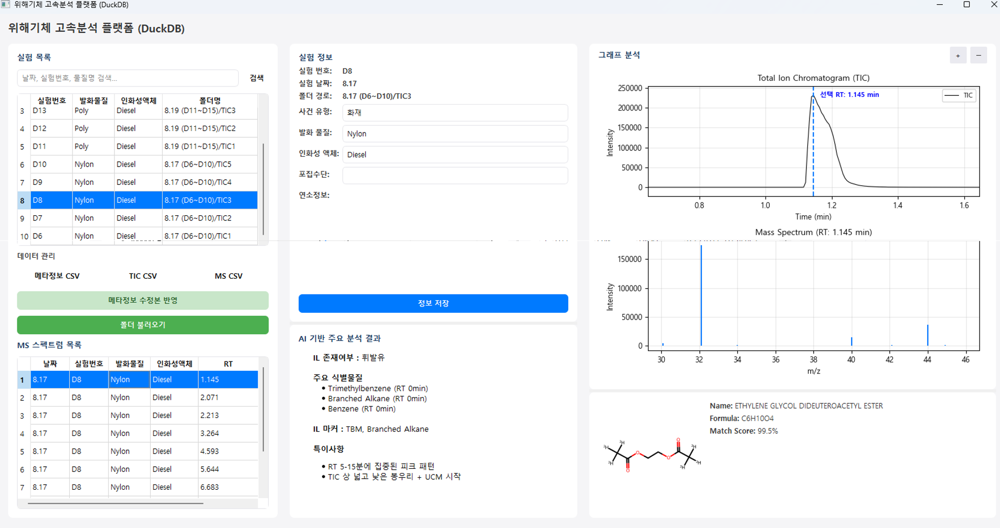

## 1. 프로젝트 개요

- **목표:** GC/MS(가스 크로마토그래피-질량 분석기) 원본 데이터를 체계적으로 관리하고 AI 분석과 연동하는 데이터베이스 관리 프로그램 구축
- **핵심 과제:** 텍스트 파일 내 중첩되어 저장된 GC/MS 원본 데이터를 파싱하고, 검색/시각화/처리가 가능한 구조화된 DB로 변환하는 백엔드 시스템 개발
- **역할:** DB 스키마 설계, Python(FastAPI) 백엔드 개발, `pyopenms` 기반 데이터 처리 로직 구현

## 2. 핵심 기능 및 개발 내용

### 2-1. GC/MS 원본 데이터 처리

**PyOpenMS 기반 스펙트럼 추출 및 전처리**

- `.txt` 포맷의 원본 데이터에서 **질량 스펙트럼(Mass Spectrum)** 과 **총 이온 크로마토그램(TIC)** 데이터를 자동 추출하는 파이프라인을 구현했습니다.
- 분석 정확도 향상을 위해 **Savitzky-Golay 필터 기반 스펙트럼 스무딩** 및 노이즈 제거 로직을 개발했습니다.
- m/z 값, 강도(intensity), 체류 시간(retention time) 등 핵심 분석 파라미터를 정규화하여 DB에 저장 가능한 형태로 변환했습니다.

### 2-2. 자동 시각화 및 저장

**Matplotlib 기반 시각화 시스템**

- 사용자가 DB에서 샘플 선택 시 해당 샘플의 MS 및 TIC 데이터를 **자동으로 시각화**하는 API를 구현했습니다.
- 스펙트럼 이미지를 서버에 자동 저장하고, 파일 경로를 DB에 연동하여 관리하는 시스템을 구축했습니다.
- 다중 샘플 비교를 위한 오버레이(overlay) 플롯 생성 기능을 개발했습니다.

### 2-3. 데이터베이스 구축 및 관리

**DuckDB 기반 스키마 설계 및 API 개발**

- 스펙트럼 데이터, 피크 리스트, 샘플 메타데이터를 효율적으로 저장하는 **정규화된 DB 스키마**를 설계했습니다.
- 샘플 ID, 분석 날짜, 장비 정보 등 다양한 조건으로 데이터를 검색할 수 있는 **FastAPI 기반 RESTful API**를 구현했습니다.
- 대용량 스펙트럼 데이터 처리를 위해 DuckDB의 컬럼 기반 저장 구조와 벡터화 연산을 활용하여 쿼리 성능을 최적화했습니다.

### 2-4. 일괄 처리 및 내보내기

**배치 프로세싱 및 데이터 익스포트**

- 여러 샘플 파일을 동시에 처리하는 **병렬 일괄 분석(Batch Processing)** 시스템을 구현하여, 수십 개의 샘플을 몇 분 내에 처리할 수 있도록 했습니다.
- ThreadPoolExecutor를 활용한 멀티스레딩으로 파일 I/O와 데이터 처리 성능을 개선했습니다.
- 분석 결과를 **Excel 또는 CSV 파일로 내보내기** 기능을 개발하여, 연구자들이 후속 분석에 활용할 수 있도록 했습니다.

<figure style="margin: 2rem 0;">
  
  <figcaption style="text-align: center; color: #6b7280; font-size: 0.9rem; margin-top: 0.5rem; font-style: italic;">
    Figure 1. GC/MS 데이터 분석 프로그램 화면 예시
  </figcaption>
</figure>

## 3. 시스템 아키텍처 및 기술 스택

본 시스템은 **PyQt5 기반 데스크톱 애플리케이션**으로 구현되었습니다.

**기술 스택**

- **Frontend:** PyQt5 (Python GUI 프레임워크)
- **Backend:** Python, PyOpenMS (데이터 처리 엔진)
- **Database:** DuckDB (임베디드 데이터베이스)
- **Visualization:** Matplotlib (스펙트럼 시각화)
- **배포:** PyInstaller (단일 실행 파일 패키징)

**시스템 구조**

- PyQt5로 구현된 직관적인 데스크톱 GUI 인터페이스
- 파일 탐색기, 데이터 뷰어, 플롯 표시 등 사용자 친화적 UI 제공
- PyOpenMS 기반 백엔드 데이터 처리 엔진
- DuckDB에 스펙트럼 데이터 및 메타데이터 저장
- Matplotlib으로 실시간 스펙트럼 시각화
- 단일 .exe 파일로 배포하여 설치 없이 실행 가능

**핵심 특징**

- PyQt5의 위젯 기반 UI로 직관적인 사용자 경험 제공
- DuckDB의 임베디드 아키텍처로 별도 DB 서버 설치 불필요
- 멀티스레딩을 통한 백그라운드 데이터 처리로 UI 응답성 확보
- PyOpenMS로 표준 질량분석 데이터 포맷(mzML, mzXML) 지원
- 모듈화된 구조로 향후 AI 분석 모듈 연동 확장 가능