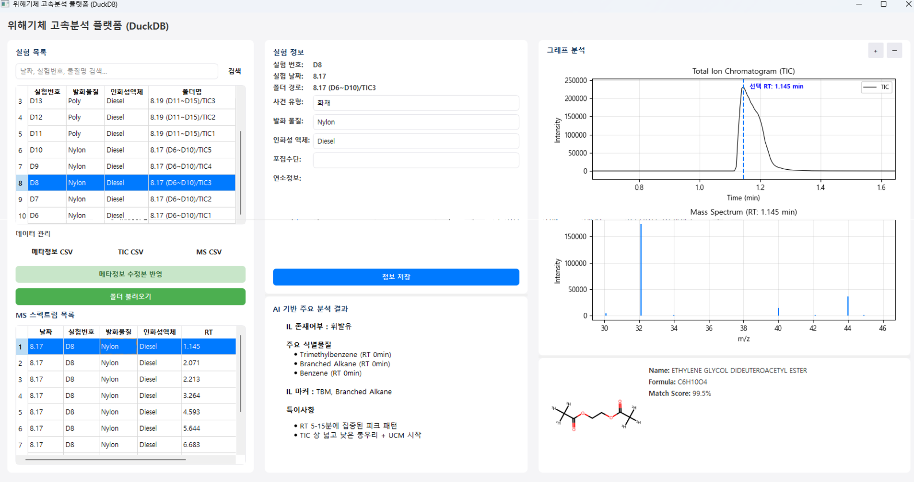

## 1. 프로젝트 개요

- **목표:** 현장에서 인터넷 연결 없이 GC/MS(가스 크로마토그래피-질량 분석기) 대용량 데이터를 즉시 처리하고, DB화하여 관리하는 독립형 데스크톱 애플리케이션 구축
- **핵심 과제:** 텍스트 포맷(.txt)의 비정형 GC/MS 원본 데이터를 파싱하여 정형 데이터로 변환하고, 로컬 환경에서 고속 검색 및 시각화가 가능한 시스템 개발
- **역할:** DB 스키마 설계, PyQt5 기반 GUI 개발, `matchms` 라이브러리를 활용한 스펙트럼 유사도 분석 로직 구현

## 2. 핵심 기능 및 개발 내용
ㄴ
### 2-1. GC/MS 원본 데이터 파싱 및 처리

**Custom Parsing 및 MatchMS 기반 분석**

- **정규표현식(Regex) 기반 파서 개발:** `pyopenms`와 같은 무거운 라이브러리 의존성을 제거하고, `.txt` 포맷의 원본 데이터 헤더와 본문을 정교하게 파싱하여 TIC(총 이온 크로마토그램) 및 MS(질량 스펙트럼) 데이터를 추출하는 경량화 로직을 구현했습니다.
- **스펙트럼 유사도 매칭:** `matchms` 라이브러리의 `CosineGreedy` 알고리즘을 도입하여, 추출된 스펙트럼과 라이브러리(MoNA 등) 간의 유사도를 계산하고 미지 시료를 식별하는 기능을 개발했습니다.
- **메타데이터 자동 추출:** 파일명과 내부 헤더에서 RT(Retention Time), 발화 물질, 인화성 액체 정보를 자동으로 추출하여 DB에 적재합니다.

### 2-2. 인터랙티브 시각화 시스템

**Matplotlib & PyQt5 임베딩 시각화**

- `FigureCanvasQTAgg`를 활용해 **PyQt5 위젯 내에 Matplotlib 그래프를 직접 렌더링**하여 웹 브라우저 없이도 고해상도 그래프를 제공합니다.
- **동적 그래프 상호작용:** TIC 그래프에서 특정 RT를 클릭하면 해당 시점의 MS 스펙트럼이 하단에 즉시 표시되는 `Signal-Slot` 기반의 연동 뷰를 구현했습니다.
- **GraphDetailDialog 구현:** `NavigationToolbar`를 커스터마이징하여 사용자가 관심 구간을 자유롭게 확대(Zoom), 이동(Pan), 리셋할 수 있는 정밀 분석 팝업창을 개발했습니다.

### 2-3. 데이터베이스 구축 및 관리

**DuckDB 기반 로컬 데이터 웨어하우스**

- **임베디드 DB 적용:** 별도의 서버 설치가 필요 없는 **DuckDB**를 채택하여, 단일 파일(`mass_spec.db`) 내에 수천 건의 실험 데이터를 효율적으로 관리합니다.
- **고속 데이터 입출력:** `executemany`를 활용한 Bulk Insert 방식으로 대량의 시계열 데이터를 빠르게 적재하며, 물질명/날짜/실험번호 등 다양한 조건으로 데이터를 즉시 조회하는 SQL 쿼리 최적화를 수행했습니다.
- **데이터 정규화:** `experiments`(메타정보), `tic_data`(시계열), `ms_spectra`(스펙트럼) 테이블로 스키마를 분리 설계하여 데이터 중복을 최소화했습니다.

### 2-4. 일괄 처리 및 데이터 내보내기

**폴더 단위 배치 프로세싱 & CSV Export**

- **폴더 구조 자동 인식:** 복잡한 실험 폴더 계층 구조를 재귀적으로 탐색하여, 수십 개의 실험 데이터 폴더를 한 번에 DB로 로드하는 배치 프로세싱(Batch Processing) 기능을 구현했습니다.
- **진행 상황 모니터링:** `QProgressDialog`를 통해 대량 데이터 처리 진행률을 실시간으로 사용자에게 피드백합니다.
- **데이터 자산화:** 분석된 메타정보, TIC, MS 데이터를 각각 CSV로 추출하는 기능을 제공하여 2차 연구 및 통계 분석에 활용할 수 있도록 지원했습니다.

<figure style="margin: 2rem 0;">
  
  <figcaption style="text-align: center; color: #6b7280; font-size: 0.9rem; margin-top: 0.5rem; font-style: italic;">
    Figure 1. GC/MS 데이터 분석 프로그램 실행 화면
  </figcaption>
</figure>

## 3. 시스템 아키텍처 및 기술 스택

본 시스템은 폐쇄망 환경에서도 구동 가능한 **PyQt5 기반 독립형 데스크톱 애플리케이션**입니다.

**기술 스택**

- **Frontend:** PyQt5 (사용자 인터페이스 및 이벤트 처리)
- **Data Processing:** Python (Re, NumPy, Pandas), matchms (스펙트럼 매칭)
- **Database:** DuckDB (In-process OLAP Database)
- **Visualization:** Matplotlib (Qt5Agg 백엔드 연동)
- **Deployment:** PyInstaller (단일 실행 파일 패키징)

**시스템 구조**

- **Monolithic Architecture:** GUI, 데이터 처리, DB 엔진이 하나의 프로세스 내에서 동작하여 지연 시간을 최소화
- **DB 연동:** `duckdb.connect()`를 통해 로컬 DB 파일에 직접 접근, 서버 통신 오버헤드 제거
- **라이브러리 매칭:** 로컬에 저장된 Pickle 파일(`.pkl`) 형태의 라이브러리를 로드하여 실시간 스펙트럼 비교 수행
- **배포 편의성:** `sys._MEIPASS`를 활용해 리소스 파일을 포함한 EXE 파일 생성, 별도 환경 설정 없이 즉시 실행 가능