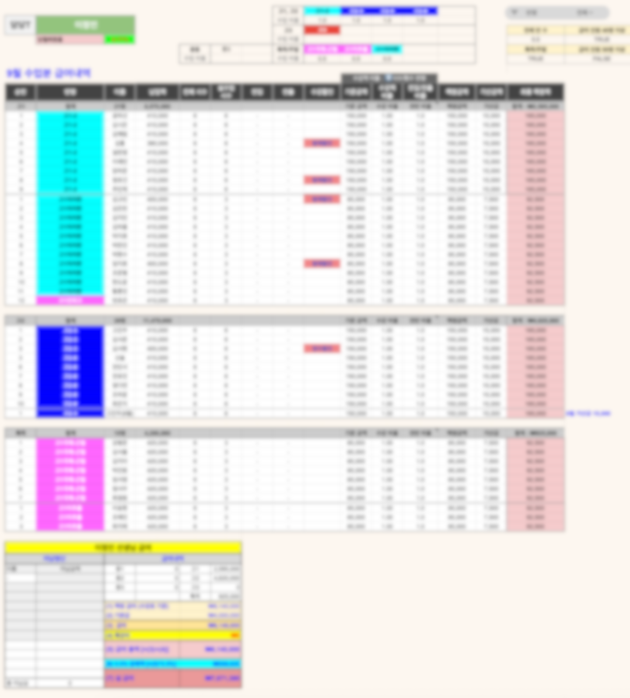
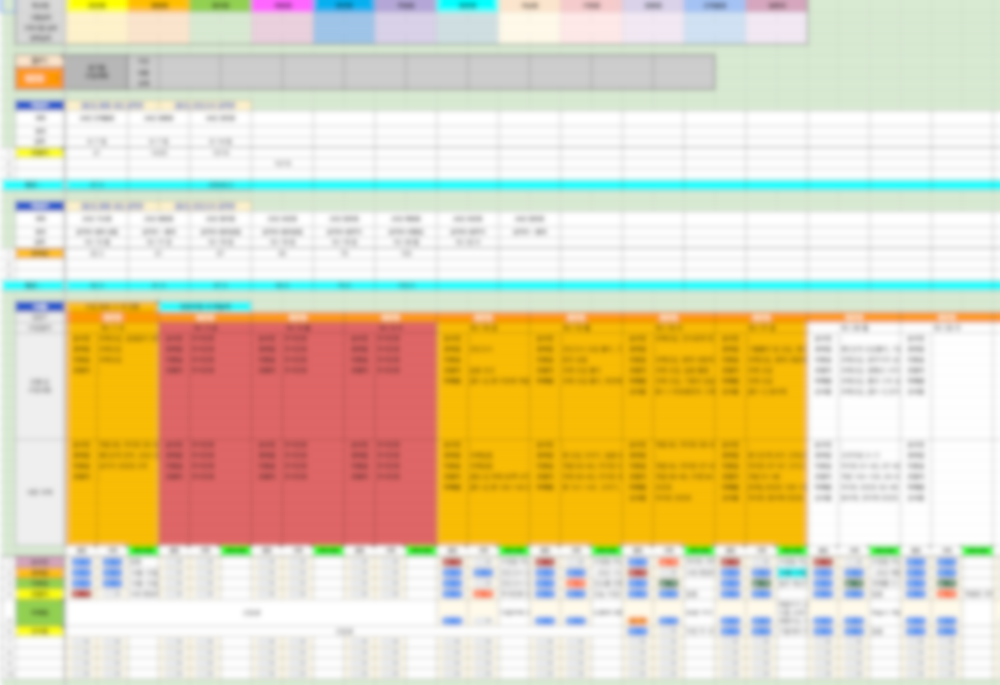
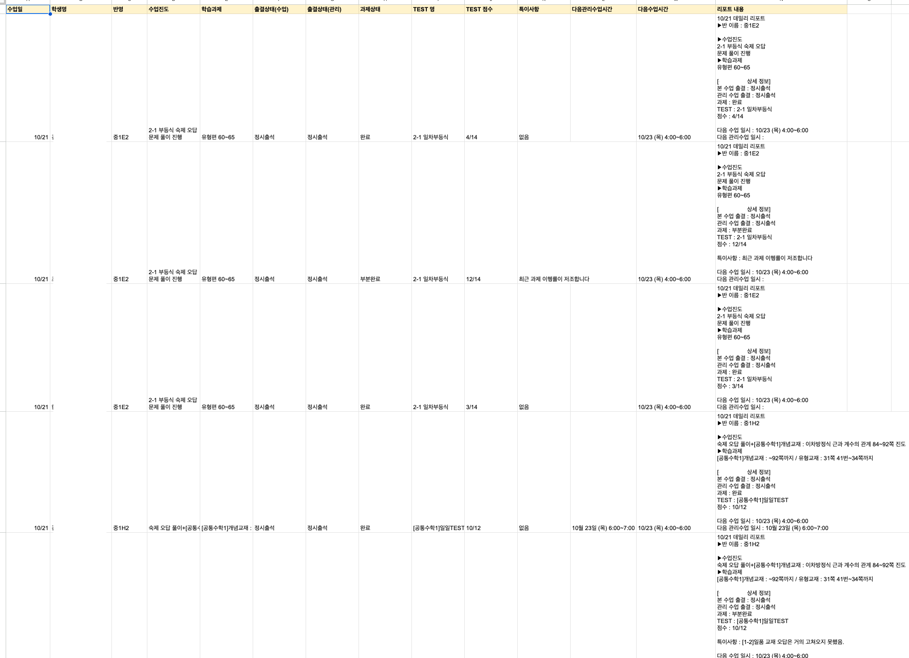
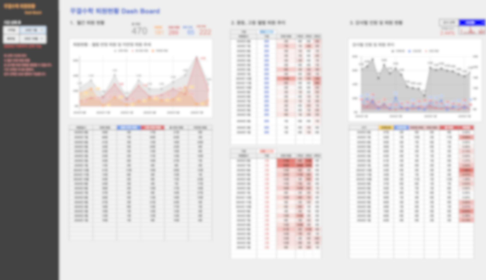
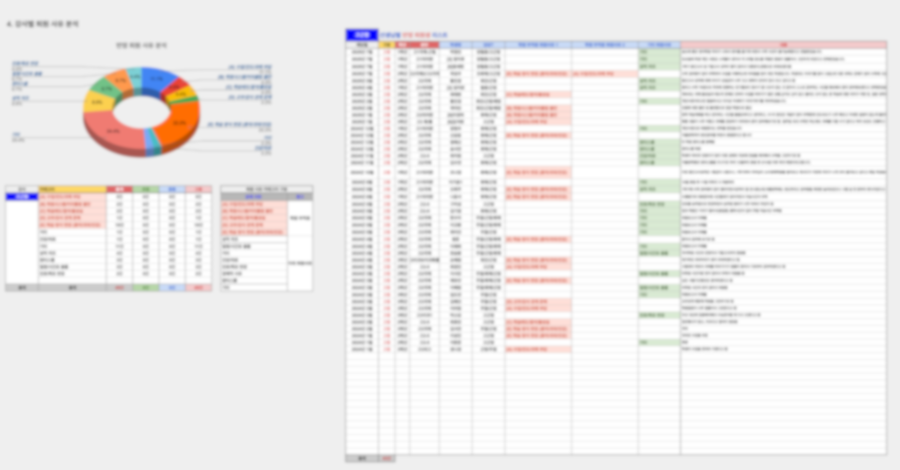

## 1. 프로젝트 개요
- **배경:** "4년간 학원에서 근무하며 조교 업무를 시작으로 데이터 운영, 자동화, 업무 시트 제작 전반을 담당하였습니다. 학원이 전체 수강생 190명에서 390명으로 성장하는 과정에 기여하며, 데이터 및 시트 운영 효율화를 위한 작업을 꾸준히 수행하고 개선하였습니다. 그중 일부 주요 내용을 아래에 기재합니다."
- **목표:** 학원 운영 전반의 수작업 프로세스를 자동화하여 업무 효율성 향상 및 데이터 기반 의사결정 지원
- **주요 시스템:** 급여 정산 자동화, 재피아 연동 데일리 리포트, 퇴원 분석 대시보드
- **핵심 성과:** 월 50시간 이상의 수작업 시간 절감, 실시간 데이터 기반 경영 의사결정 가능

## 2. 주요 시스템 및 기능

### 2-1. 급여 정산 자동화 시스템

**기존 문제점**
- 아카(학원 관리 프로그램)에서 수강/납입 내역을 수동으로 다운로드하여 Excel에서 수작업으로 급여 계산
- 강사별 수업 시간, 학생 수, 복잡한 수당 체계로 인한 계산 오류 빈번
- 월말 정산에 평균 15시간 이상 소요

**구축 내용**
- Google Sheets로 데이터를 자동 적재하고, 강사별 급여 계산 로직 구현
- 수강료 기반 수당, 학생 수 기반 성과급 등 복잡한 급여 체계를 수식으로 자동화
- 계산 결과를 강사별 급여명세서 형태로 자동 생성

**기술적 특징**
- 엑셀 쿼리문을 통해 학원 분반 목록, 미납 목록, 납입 목록, 수업현황 등 다양한 데이터를 통합하여 정산 자동화 
- 복잡한 조건부 계산 로직을 Google Sheets 수식으로 구현

<figure style="margin: 2rem 0;">
  
  <figcaption style="text-align: center; color: #6b7280; font-size: 0.9rem; margin-top: 0.5rem; font-style: italic;">
    Figure 1. 급여 정산 자동화 시스템 (임의 생성한 급여 내역 예시)
  </figcaption>
</figure>

### 2-2. 재피아 연동 데일리 리포트 시스템

**기존 문제점**
- 학생별 출결, 수업 진도, 상담 내역 등을 선생님 별 학생 관리 시트에서 일일이 확인해야 함
- 정형화된 DB 의 부재와 대시보드 형 기록 시트 형태로 강사별/반별 현황을 파악을 수작업으로 진행 
- 일일 리포트 작성에 평균 1-2시간 소요

**구축 내용**
- 학생관리부 시트와 관리수업 시트에서 추출한 학생별 일일 수업 현황 기록을 정형화된 DB 스키마로 변환
- **학생 관리부**: 학생별 출결, 성적, 상담 이력을 한눈에 볼 수 있는 대시보드형 기록시트 
- **관리 수업 시트**: 반별/강사별 수업 현황, 진도, 과제 제출 현황을 기록하는 대시보드형 기록시트
- **비정형 데이터 정형화**: 위 두개 시트에서 데이터를 추출하여 DB 스키마로 변환 후 데일리 레포트 발생 양식 생성까지 자동화 

  <figure style="margin: 0;">
    
    <figcaption style="text-align: center; color: #6b7280; font-size: 0.9rem; margin-top: 0.5rem; font-style: italic;">
      Figure 2(a). 학생 관리부 대시보드 예시 (비식별화 처리)
    </figcaption>
  </figure>
  <figure style="margin: 0;">
    
    <figcaption style="text-align: center; color: #6b7280; font-size: 0.9rem; margin-top: 0.5rem; font-style: italic;">
      Figure 2(b). 학생별 데일리 레포트 발생 양식 예시 
    </figcaption>
  </figure>

**시스템 구조**
- 시트별 데이터 추출 → 자바 스크립트를 통한 전처리 및 데이터 정제 → Google Sheets DB 적재 → 일일 레포트 내용 생성 → 재피아를 통해 학생별 카카오톡 레포트 자동 발송 
- 사용자 친화적 UI: 드롭다운, 조건부 서식, 데이터 검증 기능으로 직관적인 인터페이스 구현

### 2-3. 인원 현황 및 퇴원율 분석 대시보드

**기존 문제점**
- 인원 추이 및 퇴원율은 학원 운영에서 매출과 직결되는 핵심 지표이나 수작업으로 트랙킹. 
- 퇴원 원인 분석을 통한 개선 액션 도출 및 조기 이탈 방지 체계의 부재.

**구축 내용**
- 지정 기간동안 학원생 인원 추이와 신입·퇴원 추이를 시각화 
- 퇴원 데이터를 체계적으로 수집·분류하는 입력 양식 설계
- 퇴원 사유를 10개 카테고리로 분류 체계 구축
  - (A) 수업/진도/과제 부담
  - (B) 학원 시스템/커리큘럼 불만
  - (C) 학습태도/결석/불성실
  - (D) 교우/강사 관계 문제
  - (E) 학습 방식 변경 (혼자/과외/인강)
  - 기타: 거리, 건강, 일정 충돌, 성적 저조, 진로 변경 등

<figure style="margin: 2rem 0;">
  
  <figcaption style="text-align: center; color: #6b7280; font-size: 0.9rem; margin-top: 0.5rem; font-style: italic;">
    Figure 3. 퇴원 분석 대시보드 - 월별 추이 및 사유 분석
  </figcaption>
</figure>

**주요 기능**
1. **월별 퇴원 현황**: 전체/중등/고등 퇴원자 수 추이 시각화
2. **중등·고등 월별 추이**: 학년별 퇴원 패턴 비교 분석
3. **강사별 인원 및 퇴원 현황**: 강사별 퇴원율 비교 (선택 필터 기능)
4. **퇴원 사유 분포 분석**: 파이차트로 주요 퇴원 원인 시각화
5. **상세 퇴원 리스트**: 학생별 퇴원 일시, 사유, 상담 내역 통합 관리

<figure style="margin: 2rem 0;">
  
  <figcaption style="text-align: center; color: #6b7280; font-size: 0.9rem; margin-top: 0.5rem; font-style: italic;">
    Figure 4. 강사별 퇴원생 사유 상세 분석
  </figcaption>
</figure>

**데이터 기반 인사이트**
- 퇴원 사유 1위: "학습 방식 변경" (22.2%) → 맞춤형 학습 지원 필요성 확인
- 퇴원 사유 2위: "수업/진도/과제 부담" (11.1%) → 학습 부담 완화 방안 마련
- 강사별 퇴원율 편차 분석을 통한 강사 교육 및 관리 개선

## 3. 시스템 아키텍처

**기술 스택**
- **Data Source:** 아카(ACA) (학원 관리 프로그램)
- **Database:** Google Sheets (실시간 협업 가능한 클라우드 DB)
- **Automation:** Google Apps Script (자바 스크립트) 
- **Visualization:** Google Sheets (차트, 조건부 서식, 피벗 테이블)

**시스템 흐름**
1. 재피아에서 수강/납입/학생 관리 데이터 다운로드 (CSV/Excel)
2. Python 스크립트로 데이터 전처리 및 검증
3. Google Sheets API를 통한 자동 데이터 적재
4. Google Sheets 수식 및 Apps Script로 자동 계산 및 리포트 생성
5. 관리자에게 실시간 대시보드 제공

**핵심 특징**
- **Zero Setup**: 별도 서버 구축 없이 Google Sheets를 임베디드 DB로 활용
- **Real-time Collaboration**: 여러 관리자가 동시에 데이터 조회 및 수정 가능
- **User-Friendly**: 비개발자도 쉽게 사용할 수 있는 직관적인 스프레드시트 UI
- **Scalability**: 모듈화된 구조로 신규 기능 추가 용이

## 4. 프로젝트 성과

**정량적 성과**
- **업무 시간 절감**: 월 50시간 이상의 반복 작업 자동화 (급여 정산 10시간, 일일 리포트 30시간)
- **데이터 정확도**: 수작업 오류 제거로 급여 정산 정확도 95% 달성
- **의사결정 속도**: 퇴원 분석 대시보드를 통한 즉각적인 문제 파악 (기존 월 1회 → 실시간)

**정성적 성과**
- 데이터 기반 학원 운영 문화 정착
- 퇴원 원인 분석을 통한 학생 관리 품질 향상
- 강사 및 관리자의 행정 업무 부담 경감으로 교육에 집중할 수 있는 환경 조성