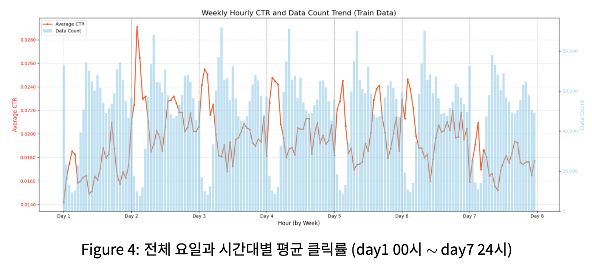
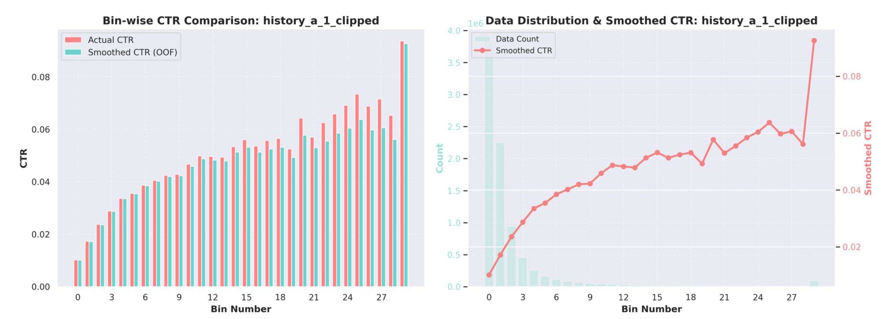
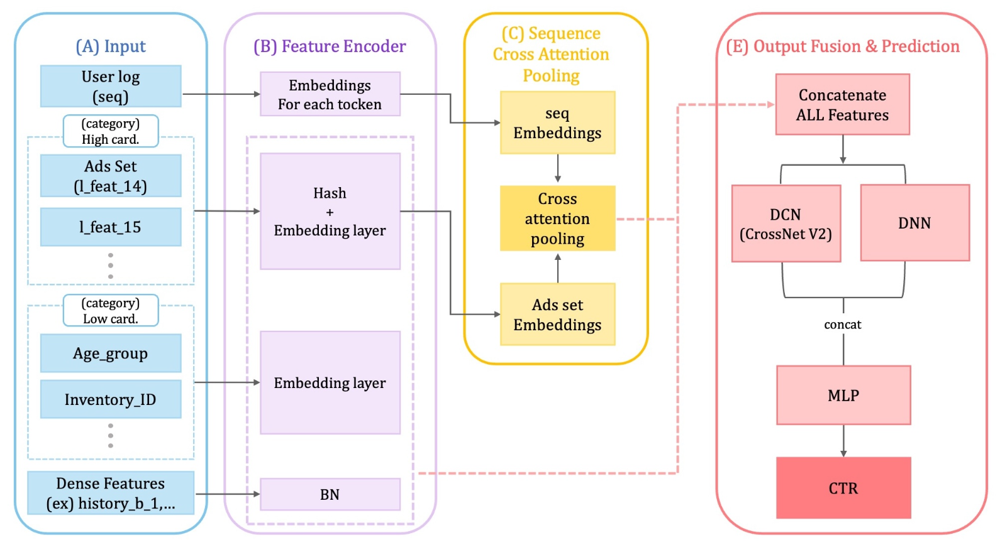

## 1. 프로젝트 개요

- **대회:** Toss NEXT ML CHALLENGE
- **목표:** 토스(Toss) 앱 내 광고 클릭 확률(CTR) 예측 모델 개발.
- **핵심 과제:** 사용자, 광고, 피처가 모두 비식별화되어, 기존의 User-Item 관계 기반 솔루션 적용에 한계가 있었습니다. 이에 데이터 자체의 내재된 구조와 통계적 패턴을 탐색하는 **데이터 중심적(Data-Centric) 접근**을 시도했습니다.

## 2. 접근 방식

### 2-1. 다층적 피처 엔지니어링

데이터의 숨겨진 패턴을 유의미한 신호로 변환하기 위해 다층적 피처 파이프라인을 구축했습니다.

- **기초 전처리:** 중복 컬럼 제거, 이상치 완화를 위한 분위수 클리핑(Clipping), 양봉형 분포 변수에 대한 이진 플래그 생성, 준이산형 변수의 이산화(최대공약수 활용) 등을 수행했습니다.
- **시간 파생 변수 생성:** 시간/요일의 주기성을 반영한 순환 인코딩(Sine/Cosine) 및 주말/시간대 플래그를 생성했습니다.
<figure style="margin: 2rem 0;">
  
  <figcaption style="text-align: center; color: #6b7280; font-size: 0.9rem; margin-top: 0.5rem; font-style: italic;">
    Figure 1.  전체 요일과 시간대별 평균 클릭률 (day1 00시∼ day7 24시)
  </figcaption>
</figure>

- **통계량 피처:** `history` 계열 변수들을 블록으로 보고, 블록별 합, 평균, 엔트로피(HHI) 등 분포와 집중도를 요약하는 통계량을 생성했습니다.
- **타겟 인코딩:** 히스토리 피처와 클릭률 간의 단조 증가 패턴을 포착하기 위해, OOF(Out-of-Fold) 5-겹 교차검증과 라플라스 스무딩을 활용한 Bin-CTR 피처를 생성했습니다.
<figure style="margin: 2rem 0;">
  
  <figcaption style="text-align: center; color: #6b7280; font-size: 0.9rem; margin-top: 0.5rem; font-style: italic;">
    Figure 2. 클리핑 처리 된 history_a_1 의 OOF Bin 별 클릭률 분석 : 단조 증가 형태
  </figcaption>
</figure>

- **확장 피처셋 (v2, v3, v13):** 그룹별(시간대, 요일, 광고 ID 등) 맥락을 결합하여, 세그먼트별 평균 패턴 대비 개별 사용자의 편차를 모델링하는 확장 피처셋을 설계했습니다.

### 2-2. 맞춤형 딥러닝 아키텍처 설계

피처 특성을 효과적으로 학습하기 위해 6종의 딥러닝 아키텍처를 직접 설계하여 실험했습니다.

- **CrossAttnDCN (주요 모델 1):** 사용자 로그 시퀀스를 Cross-Attention으로 효율적으로 집약하여, 타겟 광고 세트(Ads Set)와 관련성이 높은 로그 이력을 선택적으로 포착했습니다.
- **TransformerDCNHIST (주요 모델 2):** Transformer Encoder로 시퀀스의 장거리 의존성을, History Set Encoder로 히스토리 통계 피처(집합)를 동시에 모델링했습니다.

<figure style="margin: 2rem 0;">
  
  <figcaption style="text-align: center; color: #6b7280; font-size: 0.9rem; margin-top: 0.5rem; font-style: italic;">
    Figure 2. CrossAttnDCN 모델의 전체 아키텍처 구조
  </figcaption>
</figure>

### 2-3. 앙상블 전략

예측 강건성을 극대화하기 위해 다음과 같은 3가지 다양성을 확보한 **16개 모델 앙상블**을 구축했습니다.

1. **피처 버전 다양성:** v2, v3, v13 피처셋을 모두 활용.
2. **모델 구조 다양성:** Transformer, Cross-Attention, GBDT 등 8종의 다른 모델을 혼합.
3. **학습 데이터 다양성:** `train/valid` 분할 모델과 `train_all` 전체 학습 모델을 모두 포함.

또한, 불균형 데이터에서 극단 확률의 과신 문제를 완화하기 위해 단순 확률 평균 대신 **Logit 평균** 방식을 채택했습니다.

## 3. 결과 및 성과

- **최종 리더보드(LB) 점수: 0.350542 (private 10위)**
- 16개 모델 앙상블은 단일 베스트 모델(CrossAttnDCN, LB 0.349045) 대비 **LB 스코어 0.43% 향상**을 달성하며 앙상블 전략의 유효성을 입증했습니다. 
- 딥러닝 모델의 평균 CV-LB Gap(0.005872)이 GBDT 모델(0.007893) 대비 **약 19% 더 작은** 결과를 보이며 , 테스트 데이터에 대한 **안정적인 일반화 성능**을 확보했습니다.