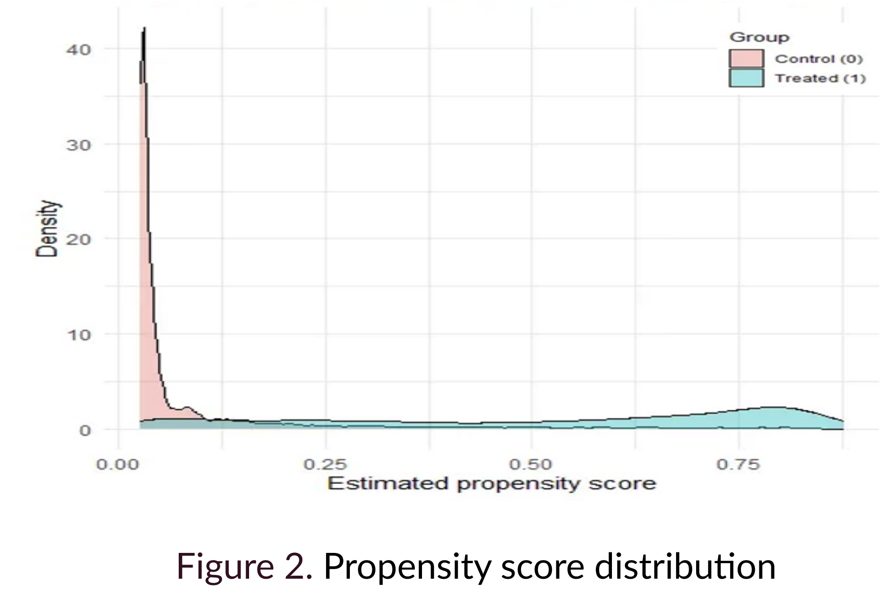

## 1. 프로젝트 개요
- **주제:** 광고 데이터의 개인별 광고 효과(Uplift), 즉 **CATE(Conditional Average Treatment Effect)** 추정
- **데이터:** Criteo Incrementality Tests 데이터 (5,000명 사용자, 84% 처리군)
- **목표:** 디지털 광고 환경에서 정확한 타겟 선정을 통해 ROI를 극대화
- **성과:** **Bayes Comp 2025 학회 포스터 발표**

## 2. 핵심 문제: 정규화로 인한 교란 편향 (RIC)

### 2-1. 강력한 교란(Strong Confounding)

Criteo 데이터셋은 광고 노출(Exposure)이 전환 성향(Conversion Propensity)이 높은 사용자에게 집중되는 **강력한 교란(Strong Confounding)** 이 존재합니다.

<figure style="margin: 2rem 0;">
  
  <figcaption style="text-align: center; color: #6b7280; font-size: 0.9rem; margin-top: 0.5rem; font-style: italic;">
    Figure 2. 처리군과 대조군의 성향 점수(Propensity Score) 분포 
  </figcaption>
</figure>

### 2-2. Regularization-Induced Confounding (RIC)

- **문제:** CATE 추정을 위해 유연한 비선형 모델(e.g., BART, 릿지 회귀)을 사용할 경우, 모델의 **정규화(Regularization) 과정 자체가 교란 변수(X)와 처리 변수(Z)의 관계를 왜곡**시켜 처리 효과 $\tau$의 추정치에 심각한 편향(Bias)을 유발합니다.

- **RIC 메커니즘:** 선형 릿지 회귀를 예로 들면, 편향은 다음과 같이 표현됩니다:

$$\text{bias}(\hat{\tau}) = -[(Z'Z)^{-1}Z'X][I + X'(X - \hat{X}_z)^{-1}]\beta$$

여기서 $\hat{X}_z = Z(Z'Z)^{-1}Z'X$ 는 Z에 X를 투영한 것입니다.

- **결과:** 정규화 강도가 커질수록 $\hat{\tau}$의 편향이 증가하며, 신뢰구간이 과도하게 좁아져(Under-coverage) 95% 신뢰구간이 실제 커버리지는 95% 미만이 됩니다.

## 3. 해결 방안: PS-BART & BCF

본 연구에서는 RIC 편향을 완화하기 위해 BART(Bayesian Additive Regression Trees) 모델을 기반으로 한 두 가지 특수화된 방법론을 적용했습니다.

### 3-1. PS-BART (Propensity-Score BART)

**방법:** 추정된 성향 점수 $\hat{\pi}(X)$를 모델의 공변량으로 직접 추가합니다.

$$Y \sim f(X, \hat{\pi}(X), Z) + \varepsilon$$

**효과:** 
- 성향 점수를 조건화함으로써 처리 변수(Z)와 공변량(X)을 비상관(decorrelate) 상태로 만듭니다.
- 선형 모델에서 RIC 편향을 완전히 제거하며, 트리 기반 모델에서도 편향을 크게 줄입니다.

### 3-2. BCF (Bayesian Causal Forest)

**방법:** 모델을 예후 효과와 처리 효과로 명시적으로 분리하여 재-파라미터화합니다.

$$Y = \mu(X, \hat{\pi}) + Z \cdot \tau(X) + \varepsilon$$

여기서:
- $\mu(X, \hat{\pi})$: 예후 효과(prognostic surface) - 통제군 하에서의 예상 결과
- $\tau(X)$: 처리 효과 함수(treatment-effect function) - 공변량 X에 따른 증분 uplift

**핵심 특징:**
- **독립적 사전분포(Independent Priors):** $\mu$와 $\tau$에 각각 다른 BART 사전분포를 적용합니다.
- **선택적 정규화:** $\tau(X)$에만 더 강한 수축(shrinkage) 적용 (더 적은 트리, 더 깊은 패널티)
- **편향 제거:** $\mu$가 예후 효과를 대부분 포착하게 하고, $\tau$가 Z와 편향된 상관관계를 갖는 것을 방지하여 RIC 편향을 제거합니다.
- **극단 성향 점수 처리:** $\hat{\pi}(X)$가 극단값일 때 사전분포가 $\tau \rightarrow 0$으로 당겨져, 올바른 95% 커버리지를 복원합니다.

## 4. 실험 결과

### 4-1. 시뮬레이션 성능

이질적인 처리 효과(Heterogeneous effect)가 있는 시뮬레이션 데이터에서 모델 성능을 비교했습니다.

**CATE 추정 성능 (RMSE, Coverage, Credible Interval Length):**

| 모델 | 동질적 효과 ||| 이질적 효과 |||
|------|---------|---------|---------|---------|---------|---------|
| | RMSE | Coverage | Length | RMSE | Coverage | Length |
| **BART** | 1.20 | 0.90 | 4.1 | 1.8 | 0.87 | 5.2 |
| **PS-BART** | 1.00 | 0.96 | 4.3 | 1.7 | 0.91 | 5.4 |
| **BCF** | **0.63** | **0.94** | **2.5** | **1.3** | **0.93** | **4.5** |

**결과:** BCF가 모든 지표에서 가장 우수한 성능을 보였으며, 특히 이질적 효과가 있을 때 RMSE가 크게 개선되었습니다.

### 4-2. Criteo 데이터 적용

BCF 모델을 Criteo 데이터에 적용하여 개인별 전환 Uplift를 추정했습니다.

**주요 발견:**
- **Top 10% 타겟팅 효과:** 광고 효과가 가장 높을 것으로 예측된 **상위 10% 사용자에게 타겟팅 시, 관측된 Uplift가 약 8.9%**로 나타났습니다.
- **전체 평균 대비 3배:** 이는 **전체 평균 Uplift(2.7%)의 3배가 넘는 수치**로, CATE 기반 정밀 타겟팅의 실질적 효과를 입증했습니다.
- **점진적 감소:** 타겟팅 비율이 증가할수록(20-80%) 추가 uplift 기여도가 2-4% 수준으로 완만해집니다.
- **예측-실측 격차:** 높은 십분위에서 예측 uplift와 관측 uplift 간의 눈에 띄는 차이는 모델 캘리브레이션의 개선 여지를 시사합니다.

## 5. 기술 스택

- **Framework:** R, BART, BCF
- **Causal Inference Methods:** PS-BART, Bayesian Causal Forest
- **Evaluation Metrics:** RMSE, Coverage, Qini Curve, NDCG
- **Data:** Criteo Incrementality Tests (5,000 users, 84% treated)

## 6. 기여 및 활용방안 
- **방법론적 기여:** 강한 교란 하에서 정규화 모델의 RIC 편향을 제어하는 베이지안 접근법 적용
- **실무 적용:** 디지털 광고 환경에서 개인화된 타겟팅 전략 수립 가능
- **확장 가능성:** 다른 마케팅 인과추론 문제(이메일 캠페인, 프로모션 최적화 등)에도 적용 가능

<figure style="margin: 2rem 0;">
  
  <figcaption style="text-align: center; color: #6b7280; font-size: 0.9rem; margin-top: 0.5rem; font-style: italic;">
    Figure 1. Bayes Comp 2025 학회 포스터 - 베이지안 인과추론 기반 Uplift Modeling
  </figcaption>
</figure>