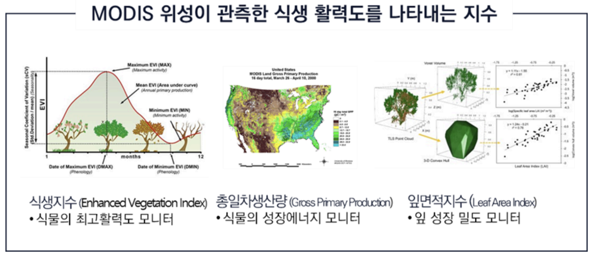
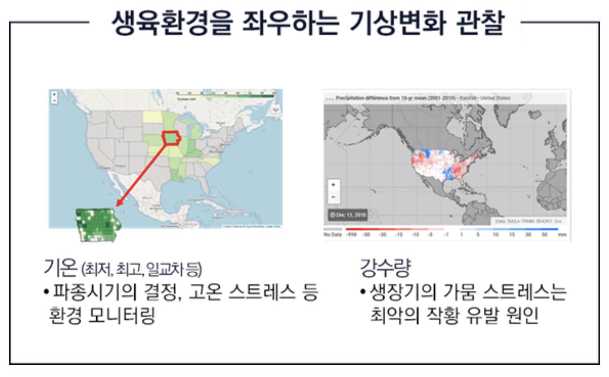

## 1. 프로젝트 개요

- **목표:** 미국 옥수수 수율(Corn Yield) 예측 모델 개발
- **활용:** 옥수수 선물 시장 투자자 대상 정보 제공
- **데이터:** 2002-2022년 미국 12개 주의 위성영상, 기상, 작황 데이터
    - **위성영상 (식생지수):** EVI, GPP, LAI
    - **기상변수:** 최고/최저기온, 일교차, 강수량
    - **작황상태 (Condition):** 설문조사 기반 작황 상태

  <figure style="margin: 0;">
    
    <figcaption style="text-align: center; color: #6b7280; font-size: 0.9rem; margin-top: 0.5rem; font-style: italic;">
      Figure 1(a). 위성이 관측한 식생 활력도를 나타내는 지수 (EVI, GPP, LAI)
    </figcaption>
  </figure>
  <figure style="margin: 0;">
    
    <figcaption style="text-align: center; color: #6b7280; font-size: 0.9rem; margin-top: 0.5rem; font-style: italic;">
      Figure 1(b). 생육 환경에 큰 영향을 주는 기상 변화 관찰
    </figcaption>
  </figure>

## 2. 데이터 분석 및 피처 엔지니어링

모델 성능 향상을 위해 도메인 지식과 데이터 탐색(EDA) 기반의 피처 엔지니어링에 집중했습니다.

- **변수 변환:** GPP(총일차생산량), PRECIP(강수량) 변수가 왼쪽으로 치우친 분포(left-skewed)를 보여, **Cube Root Transformation**을 적용하여 정규성을 확보했습니다.
- **생육 주기 반영:** 옥수수 생육 주기(Illinois 기준)를 분석, 생육이 왕성한 8월 이전(1~7시기)과 달리 9월 이후(8~10시기)의 식생지수(EVI, LAI)는 수율과의 상관성이 낮아짐을 확인했습니다. 이에 후반기 모델(model 8~10)에서 **8시기 이후 식생지수 변수를 제거**하여 성능을 개선했습니다.
- **도메인 변수 생성 (GDD):** 옥수수 생육이 온도에 큰 영향을 받음을 고려, 옥수수 기본온도(10°C)를 활용한 **'유효적산온도(GDD)'** 관련 파생변수($tm\_mean\_i = (Tmax_i + Tmin_i)/2 - 10$)를 생성했습니다.
- **핵심 변수 추출:**
    - `condition` 변수는 결측치가 많은 후반부(9, 10)를 제외하고, 1~8시기의 누적합(`condition_sum`) 변수를 생성하여 사용했습니다. 이 변수는 기존 개별 변수보다 수율과 더 뚜렷한 양의 상관관계를 보였습니다.
    - `evi` (식생지수) 변수가 개별 변수 중 수율과 가장 높은 상관관계를 보였습니다.

## 3. 모델링 및 결과

- **모델 선정:** LR, SVR, RandomForest, XGBoost, LightGBM, **CatBoost** 6개 모델을 비교했으며, 성능이 가장 우수한 CatBoost를 최종 모델로 선정했습니다.
- **최적화:**
    - **하이퍼파라미터:** **Optuna (Bayesian Optimization)** 의 TPE Sampler를 활용하여 최적의 파라미터를 탐색했습니다.
    - **앙상블:** `state` 변수가 모델 성능에 큰 영향을 줌을 확인하고, `state` 비율을 유지하는 **Stratified K-fold (K=5)**로 5개의 CatBoost 모델을 학습한 후, 예측값을 평균하여 최종 앙상블 모델을 구축했습니다.
- **최종 성과:**
    - 2022년 검증 데이터셋 기준, 수확기(model 9) 예측 모델이 **RMSE 19.49**를 달성했습니다. (사용자 요약: **기존 모델 대비 MSE 10% 감소**)
    - 변수 중요도 분석 결과, `state`, `evi`, `lai`, `condition_sum`, `tm_mean_i` (GDD) 등 핵심 변수들이 모델 예측에 가장 큰 영향을 미치는 것을 확인했습니다.