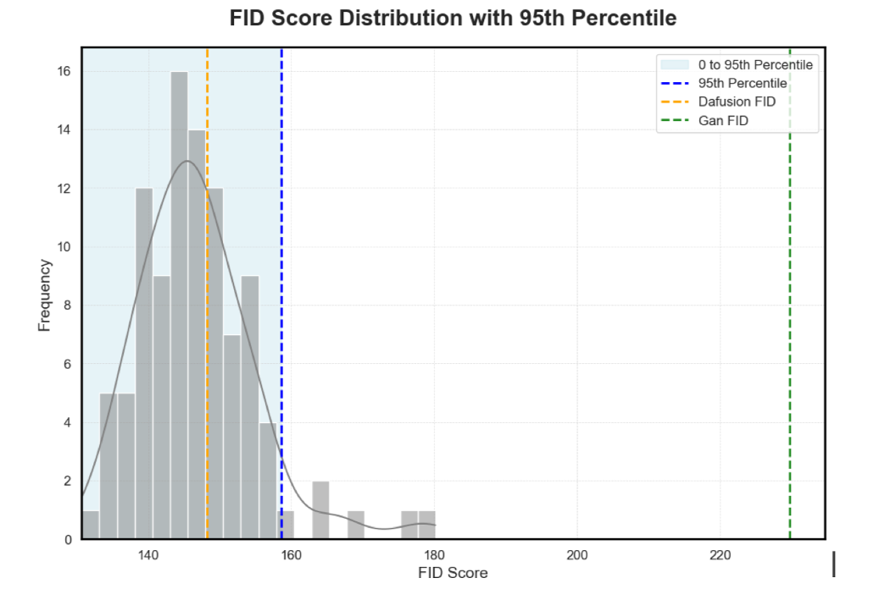
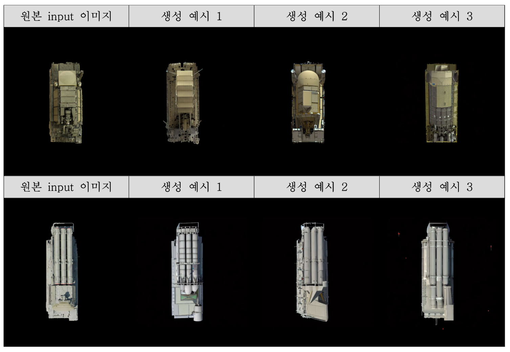
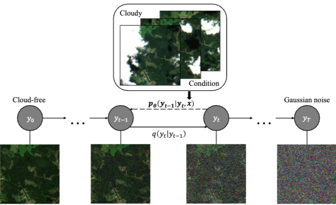
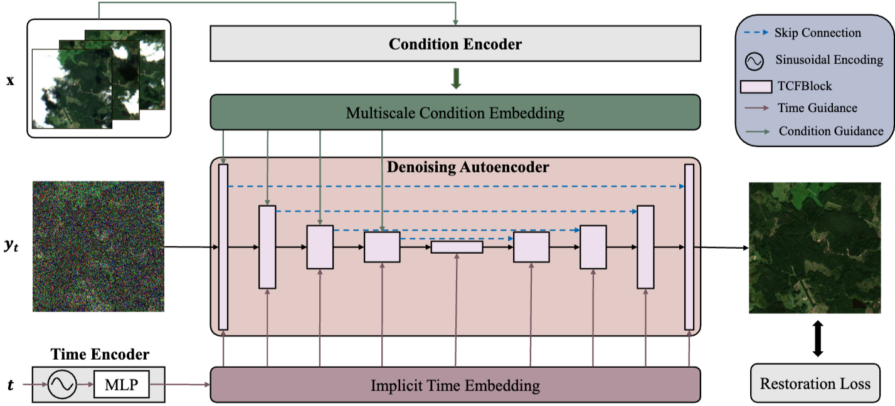
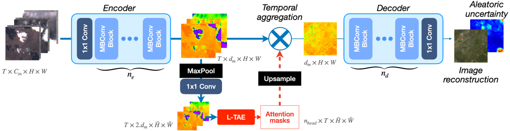

## 1. 프로젝트 개요

- **과제:** 데이터 생성/가공 및 화질개선/복원 분야 품질확보를 위한 성능 평가 방안 연구
- **발주처:** 국방기술품질원(DTAQ) 
- **역할:** 연구보조원
- **핵심 기여:** (1) 합성데이터 생성(이미지 증강) 실증, (2) 영상/이미지 복원(구름 제거) 실증

## 2. 합성데이터 생성 (이미지 증강) 실증

### 2-1. 문제 정의 

국방 분야는 **TEL(이동형 미사일 발사대)** 같은 핵심 객체 이미지가 매우 희소하여 AI 모델 학습에 필요한 데이터 확보가 어렵습니다.

### 2-2. 접근 방식: DA-Fusion

> Semantic Invariance의 필요성

TEL 증강에서는 모델별 소수의 이미지만 존재하는 데이터 특성을 고려할 때, 각 모델의 **의미적 불변성(Semantic Invariance)** 은 유지하면서 외형 및 스타일만 변경하는 증강이 필요합니다. Semantic Invariance란 특정 대상에 대한 이미지 증강에서 대상의 핵심 의미를 유지하는 능력으로, 대상의 외관이나 스타일을 변경하더라도 구조적 특성과 정체성은 일관되게 유지되는 것을 의미합니다.

GAN 기반 방법론은 모델별 구조적 특성이 변형되어 각 미사일별 모델의 특성을 비교적 유지하지 못하는 반면(Semantic Variance), **Diffusion 기반 방법론**은 모델별 구조적 특성을 반영하여 각 모델의 특성을 유지하며 외형과 스타일만 변형된 데이터 증강을 수행합니다(Semantic Invariance).

**데이터 및 모델**

- **데이터:** 13개 TEL 모델에 대해 총 58장의 원본 이미지를 수집하고, 배경 제거 등 전처리를 수행했습니다.
- **모델:** Stable Diffusion 기반의 **DA-Fusion** 모델을 채택했습니다. 이 모델은 `Textual Inversion`과 `image-to-image` 변환을 결합하여, **원본의 핵심 구조(Semantic Invariance)를 유지**하면서 외형과 스타일을 변형시켜 증강합니다.

**프로세스**

1. **Textual Inversion:** 'SA-22 Pantsir-S' 같은 고유 모델명을 텍스트 임베딩으로 학습시켰습니다.
2. **Image-to-Image:** "Top-down view of a camouflaged TEL model: {모델명}"과 같은 프롬프트와 원본 이미지를 Diffusion 모델에 입력하여 새로운 이미지를 생성했습니다.

### 2-3. 성과 및 품질 평가

원본의 구조는 유지하되 위장 패턴, 색상 등이 변형된 고품질의 증강 이미지 **580장**을 26분 동안 생성했습니다.

  <figure style="margin: 0;">
    
    <figcaption style="text-align: center; color: #6b7280; font-size: 0.9rem; margin-top: 0.5rem; font-style: italic;">
      Figure 1(a). GAN과 Diffusion 기반 증강 결과 비교
    </figcaption>
  </figure>
  <figure style="margin: 0;">
    
    <figcaption style="text-align: center; color: #6b7280; font-size: 0.9rem; margin-top: 0.5rem; font-style: italic;">
      Figure 1(b). DA-Fusion 증강 이미지 결과
    </figcaption>
  </figure>

**1) 품질 평가 방법론** 

생성된 데이터의 품질을 **FID, CAFD, IS** 등 정량적 지표로 평가했습니다:
- 58장의 데이터를 50%, 50% 크기로 임의 분할하여 A, B 데이터셋을 구성
- A를 원본, B를 합성데이터로 가정한 후, 유용성 지표 산출(FID)
- 100번 이상의 반복을 통해 FID 값들의 임계값(95분위수) 산출

**2) 결과** 

원본 데이터의 FID 분포 95% 분위수 임계값(158.62) 대비 DA-Fusion으로 생성된 데이터의 FID(148.1)가 우수함을 입증했습니다. 반면 WGAN은 임계값보다 높은 FID를 보였습니다.

## 3. 영상/이미지 복원 (구름 제거) 실증

### 3-1. 문제 정의

항공/위성 이미지는 구름, 그림자 등 기상 노이즈로 인해 정보 획득이 어려운 경우가 많아, 이를 복원하는 기술이 필요합니다.

### 3-2. 접근 방식: Diffusion 기반 복원

**데이터 및 모델**

- **데이터:** Sentinel-2 위성 이미지 데이터(39,400장)를 활용했습니다.
- **모델:** **DiffCR**, **UnCRtainTS** 등 최신 Diffusion 기반 복원 모델을 실증했습니다.

**DiffCR**

조건부 Diffusion 모델을 활용하여 구름 낀 이미지를 조건으로 입력받아 노이즈를 제거하고 구름 없는 이미지를 복원했습니다.

<figure style="margin: 2rem 0;">
  
  <figcaption style="text-align: center; color: #6b7280; font-size: 0.9rem; margin-top: 0.5rem; font-style: italic;">
    Figure 2. DiffCR 구름 제거 프레임워크의 전체 파이프라인
  </figcaption>
</figure>

<figure style="margin: 2rem 0;">
  
  <figcaption style="text-align: center; color: #6b7280; font-size: 0.9rem; margin-top: 0.5rem; font-style: italic;">
    Figure 3. DiffCR 모델 아키텍처
  </figcaption>
</figure>

**UnCRtainTS**

다중 시계열 이미지를 활용하여 구름을 복원함과 동시에, 복원된 픽셀의 **불확실성(Aleatoric uncertainty)** 을 정량적으로 예측했습니다.

<figure style="margin: 2rem 0;">
  
  <figcaption style="text-align: center; color: #6b7280; font-size: 0.9rem; margin-top: 0.5rem; font-style: italic;">
    Figure 4. UnCRtainTS 모델 아키텍처
  </figcaption>
</figure>

### 3-3. 성과

- 입력 이미지(조건) 수가 1장에서 3장으로 증가할수록 복원 성능(PSNR, SSIM)이 향상됨을 확인했습니다 (PSNR 25.8 → 28.9).
- UnCRtainTS 모델을 통해 복원 결과의 신뢰도를 픽셀별로 정량화할 수 있음을 입증하여, AI 모델의 판단 근거를 제시했습니다.