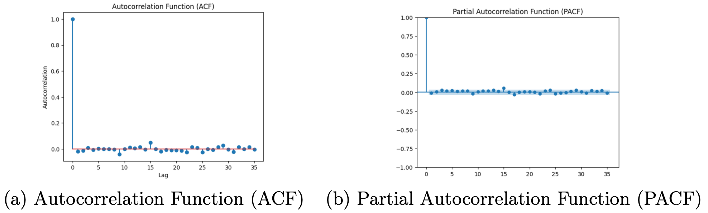
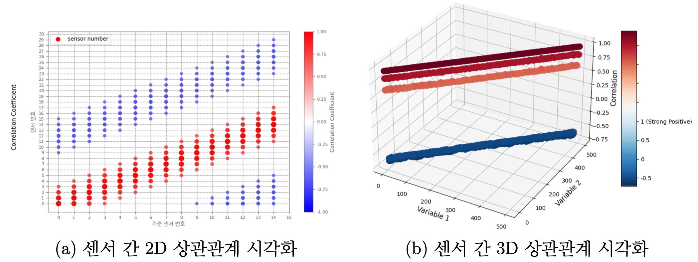
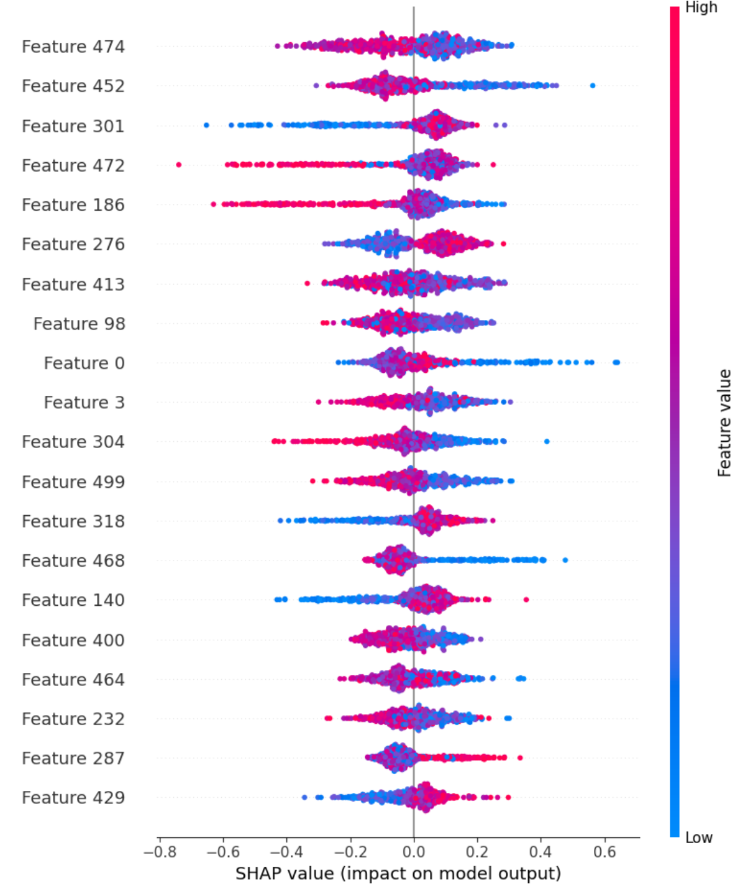
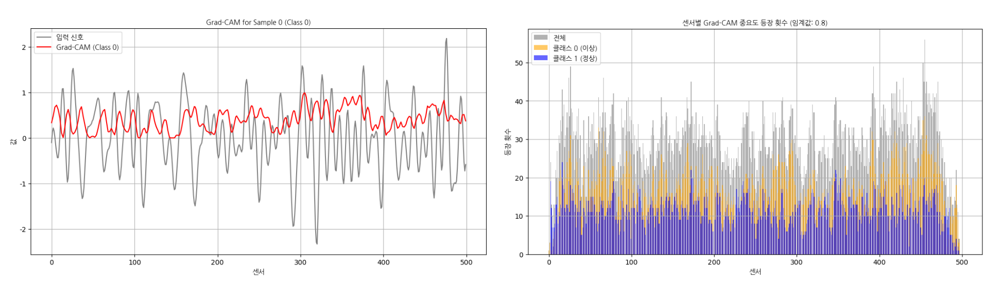

## 1. 프로젝트 개요

- **주제:** 시계열 센서 데이터 기반 엔진 이상 징후 탐지
- **목표:** 500개 엔진 센서의 시계열 데이터를 분석하여, 현재 시점의 엔진 상태를 '정상(1)' 또는 '비정상(-1)'으로 분류하는 이진 분류 모델 개발
- **데이터:** Ford사 제공 오픈 데이터셋, 4,921개 시계열 샘플, 500개 센서 피처

## 2. 데이터 탐색 및 전처리

### 시간적 특성 분석

Target(정상/비정상) 변수의 ACF/PACF 분석 결과, 시차 1 이후 시간적 상관관계가 거의 없음(White Noise)을 확인했습니다. 이는 RNN 계열 모델의 이점이 제한적일 수 있음을 시사했습니다.

<figure style="margin: 2rem 0;">
  
  <figcaption style="text-align: center; color: #6b7280; font-size: 0.9rem; margin-top: 0.5rem; font-style: italic;">
    Figure 1. Target 변수의 ACF/PACF 분석 결과
  </figcaption>
</figure>

### 센서 간 상관관계 분석

500개 센서 간 강한 상관관계 패턴을 발견했습니다. (예: 10\~13번 간격의 센서 간 음의 상관관계, 1\~3번 간격의 센서 간 양의 상관관계). 이는 센서의 물리적 인접성 등에 따른 **지역적 패턴(Local Pattern)** 이 중요함을 의미합니다. PCA 차원 축소 시 성능이 저하되어, 전체 500개 센서 변수를 모두 활용하기로 결정했습니다.

<figure style="margin: 2rem 0;">
  
  <figcaption style="text-align: center; color: #6b7280; font-size: 0.9rem; margin-top: 0.5rem; font-style: italic;">
    Figure 2. 센서 간 상관관계 분석 결과
  </figcaption>
</figure>

### 데이터 분할

시계열 특성을 유지하면서 데이터 누수를 방지하기 위해, 클래스 비율을 유지하며 시간 순서 기준(공통 80% 시점)으로 Train/Valid 셋을 분할했습니다.

## 3. 모델링 및 결과

시계열 특성과 센서 간 공간적 패턴을 고려하여 3가지 계열의 모델을 비교했습니다.

- **XGBoost:** Accuracy 74.9%, AUC 0.75. 과적합 문제가 발생했으며, 복잡한 센서 패턴 학습에 한계를 보였습니다.
- **LSTM:** Accuracy 92.9%, AUC 0.93. 준수한 성능을 보였으나, CNN 대비 학습 시간이 길고(1시간 vs 10분) 성능이 소폭 낮았습니다.
- **1D-CNN (최종 모델):**
    - **접근:** EDA에서 발견한 '센서 간 지역적 상관관계' 패턴을 포착하기 위해 1D-CNN을 채택했습니다.
    - **설계:** 센서 간 선형적 특징을 고려하여 커널 크기를 30, 15, 7, 3으로 설정하여 점진적으로 지역적 특징을 추출하도록 설계했습니다.
    - **성과:** **Test Accuracy 94.69%, AUC 0.95**로 가장 우수하고 안정적인 학습 결과를 보여 최종 모델로 선정했습니다.

## 4. XAI (설명 가능한 AI) 분석

최종 CNN 모델과 XGBoost 모델의 예측 근거를 분석하기 위해 Grad-CAM과 SHAP 기법을 적용했습니다.

<figure style="margin: 2rem 0;">
  
  <figcaption style="text-align: center; color: #6b7280; font-size: 0.9rem; margin-top: 0.5rem; font-style: italic;">
    Figure 3. 센서 번호별 SHAP 중요도 분석
  </figcaption>
</figure>

<figure style="margin: 2rem 0;">
  
  <figcaption style="text-align: center; color: #6b7280; font-size: 0.9rem; margin-top: 0.5rem; font-style: italic;">
    Figure 4. (a) 단일 샘플의 센서별 이상 여부 판단 중요도 예시 (b) 전체 샘플에 대해 0.8 이상의 중요도를 갖는 센서별 빈도 시각화
  </figcaption>
</figure>

### 분석 결과

두 XAI 기법 중 CAM에선 472/428 등의 센서들이, SHAP에선 471/429 등의 센서들이 높은 중요도를 보였습니다. 각 기법에서 중요했던 센서들은 서로 **번호가 인접한** 양상을 보이며, 모델의 이상 탐지 결정에 공통적으로 높은 중요도(Impact)를 보였습니다.

### 결론

이는 EDA에서 가정한 '센서 간 지역적 패턴'을 CNN 모델이 성공적으로 학습하여 이상 탐지의 핵심 근거로 활용했음을 시각적으로 입증합니다.