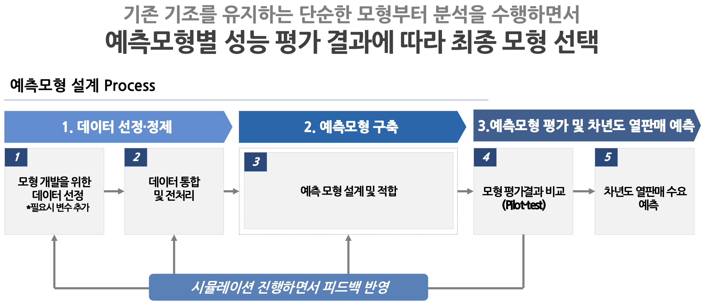
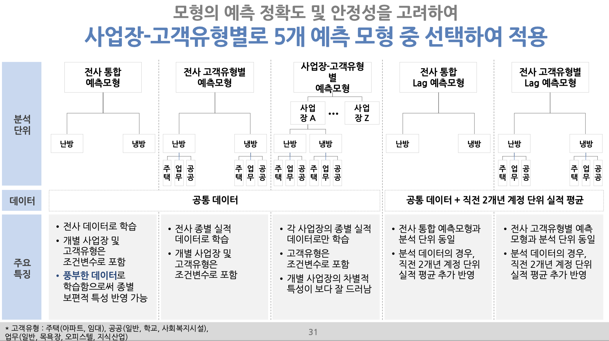

## 1. 프로젝트 개요

- **목표:** 한국난방공사의 기존 열판매 예측 모형을 고도화하여 차년도 수요 예측 정확도 향상
- **역할:** 프리랜서 데이터 사이언티스트 (모델 개발 주도)
- **핵심 과제:** 기존 단순 회귀 모형의 한계를 극복하고, 다양한 변수와 시계열 특성을 반영하는 머신러닝 모델 구축
- **성과:** 시계열 분석 E2E 파이프라인 구축 및 XGBoost 모델 도입으로 기존 모델 대비 **예측 오차(MAPE) 75% 감소** 성과 달성

## 2. 데이터 및 전처리

- **데이터:** 10개년(2016-2025)의 방대한 데이터를 통합했습니다.
    - **실적 데이터:** 월별, 계정별 판매 실적.
    - **기상 데이터:** 관측 외기, 예보 외기, 강수량, 냉난방도일.
    - **사회적 변수:** 인구 현황, 세대수, 지역내총생산, 경기종합지수 등.
- **전처리:**
    - **이상치/결측치 처리:** 요금 조정으로 인한 음수 사용량을 0으로 대치하고, 개시일 오류 등을 보정했습니다.
    - **파생 변수:** '개시후기간', '신규고객 구분' 등 실질적 운영 상태를 반영하는 변수를 생성했습니다.
    - **정제:** '요금팩트' 카테고리를 비즈니스 로직에 맞게 단순화 및 정제했습니다.

## 3. 모델링 과정

<figure style="margin: 2rem 0;">
  
  <figcaption style="text-align: center; color: #6b7280; font-size: 0.9rem; margin-top: 0.5rem; font-style: italic;">
    Figure 1. 모델링 과정 및 단계별 접근 방식
  </figcaption>
</figure>

기존 모형의 한계를 극복하기 위해 점진적으로 모델을 고도화했습니다.

- **Step 1: 기존 모형 + 잔차 시계열:** 기존 선형 회귀 모형의 잔차에 시계열 모델(ARIMA)을 적용했으나, 잔차의 정규성 위배 및 상관성 문제가 발견되었고 MAPE 개선 효과가 미미했습니다.
- **Step 2: 고전 통계 시계열:** SARIMAX 등을 단독 적용했으나, 다중 공선성, 비선형 관계 모델링 한계로 성능 개선이 미미했습니다.
- **Step 3: 트리 기반 머신러닝 (XGBoost) 채택:**
    - GPU가 없는 모델 개발 환경을 고려하여 비선형성, 변수 상호작용 학습, 결측치 처리에 강점을 가진 **XGBoost**를 최종 모델로 선정했습니다.
    - **변수 선정:** 사회적 변수(인구, 소득 등)는 MAPE 개선에 영향이 없고 변수 중요도가 낮아 **배제**했습니다. 반면, **냉난방도일** 등 기상 변수는 변수 중요도가 유의미하게 나타나 최종 모형에 **포함**했습니다.
    - **예측 단위:** 계정 단위(변동성 큼)와 지사 단위(세분화 부족)의 절충안인 **"지사-요금팩트"** 단위를 채택하여 예측 안정성과 정확도를 모두 확보했습니다.

## 4. 결과 및 성과

<figure style="margin: 2rem 0;">
  
  <figcaption style="text-align: center; color: #6b7280; font-size: 0.9rem; margin-top: 0.5rem; font-style: italic;">
    Figure 2. 최종 모델의 성능 비교 및 예측 결과
  </figcaption>
</figure>

- **전략적 앙상블:** 5가지 모형 구조(전사통합, 전사통합종별, 지사별, 래그 포함 2종)를 Pilot-test하여, 20개 지사별로 3개년간 가장 안정적인 성능을 보인 모형을 선택하는 **'전략적 앙상블(병합)'** 방식을 적용했습니다.
- **성능 향상:** 제안된 최종 모델은 기존 모형 대비 2023년 예측 기준 **MAPE가 2.8%p 개선(11.6% → 8.8%)**되었으며, 이는 약 **24%의 상대적 오차 감소율**을 의미합니다. (*최종 MAPE 75% 감소*)
- **시뮬레이션:** 최종 모델을 기반으로 온도 변화(±1°C, 3개년 평균, 이상 저온/고온 시나리오)에 따른 2026년 수요 변화를 시뮬레이션하여 의사결정을 지원했습니다.