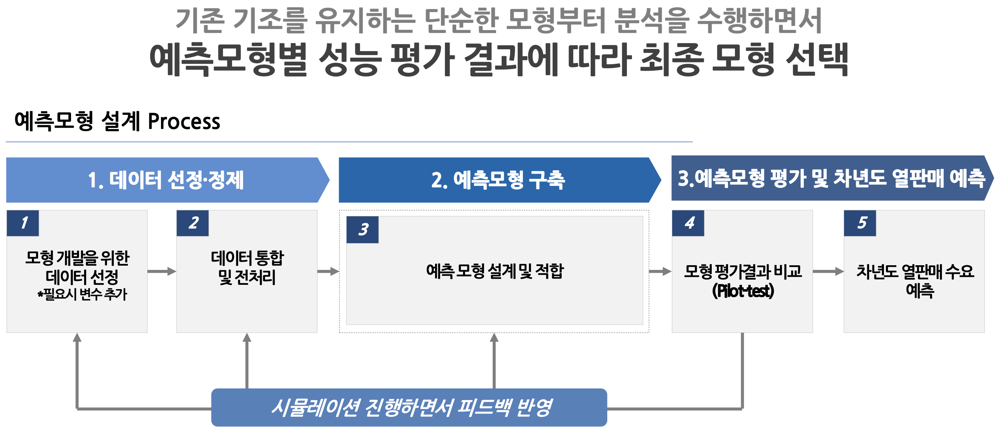
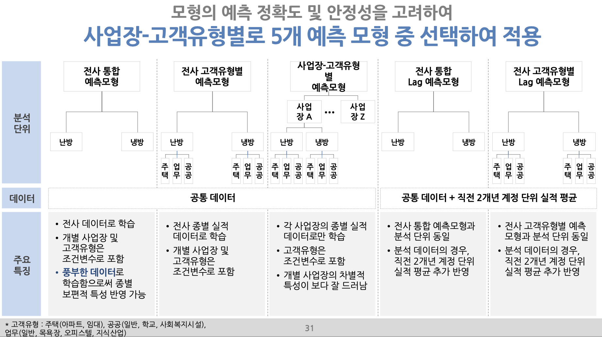

## 1. 프로젝트 개요

한국난방공사의 차년도 열판매 수요 예측 정확도를 높이기 위해 기존 단순 회귀 모형을 고도화하는 프로젝트를 수행했습니다. 프리랜서 데이터 사이언티스트로서 모델링 전 과정을 주도했으며, 다양한 변수와 시계열 특성을 반영한 머신러닝 파이프라인을 구축했습니다. 그 결과 기존 모델 대비 예측 오차(MAPE)를 약 24% 감소시키는 성과를 달성했습니다.

## 2. 데이터 및 전처리

**2016년부터 2025년까지 10개년 데이터 통합**
월별·계정별 판매 실적, 기상 데이터(관측/예보/냉난방도일), 사회적 변수(인구/GDP 등)를 결합하여 분석 데이터셋을 구축했습니다.

**데이터 정제 및 파생변수 생성**
- 요금 정산 과정에서 발생하는 음수 사용량 등 이상치를 보정하고 결측치를 처리했습니다.
- 단순 실적 외에 '개시 후 기간', '신규 고객 구분' 등 실제 운영 현황을 반영하는 파생 변수를 추가해 모델의 설명력을 높였습니다.
- 복잡한 요금 카테고리를 비즈니스 로직에 맞춰 재정의하여 분석 효율을 확보했습니다.

## 3. 모델링 과정

<figure style="margin: 2rem 0;">
  
  <figcaption style="text-align: center; color: #6b7280; font-size: 0.9rem; margin-top: 0.5rem; font-style: italic;">
    Figure 1. 모델링 단계별 접근 방식
  </figcaption>
</figure>

기존 통계 모형의 한계를 넘기 위해 단계적으로 접근 방식을 고도화했습니다.

1.  **초기 시도 (통계적 접근):** 기존 선형 회귀 잔차에 ARIMA를 적용하거나 SARIMAX를 단독 사용했으나, 데이터의 비선형성과 다중공선성 문제로 성능 개선에 한계가 있었습니다.
2.  **XGBoost 모델 채택:** 비선형 관계 학습과 결측치 처리에 강한 **XGBoost**를 최종 알고리즘으로 선정했습니다. GPU 부재 환경에서도 효율적인 학습이 가능했습니다.
3.  **최적화 전략:**
    * **변수 선택:** 중요도가 낮은 인구·소득 등 사회적 변수는 배제하고, 설명력이 높은 **기상 변수(냉난방도일 등)**를 중심으로 학습했습니다.
    * **예측 단위:** 데이터 변동성과 세분화 수준을 고려하여 **'지사-요금팩트'** 단위를 선정, 예측 안정성을 확보했습니다.

## 4. 결과 및 성과

<figure style="margin: 2rem 0;">
  
  <figcaption style="text-align: center; color: #6b7280; font-size: 0.9rem; margin-top: 0.5rem; font-style: italic;">
    Figure 2. 최종 모델 성능 비교 및 예측 시뮬레이션
  </figcaption>
</figure>

- **전략적 앙상블 도입:** 전사 통합, 지사별 모델 등 5가지 구조를 테스트한 뒤, 20개 지사별로 가장 성능이 뛰어난 모델을 선별하여 병합하는 방식을 적용했습니다.
- **예측 정확도 개선:** 최종 모델의 MAPE는 8.8%로, 기존 모델의 대비 24% 오차를 감소시켰습니다. 
- **의사결정 지원:** 구축된 모델을 활용해 기온 변화(이상기온, 예보보정) 시나리오에 따른 2026년 수요 예측 결과를 제공하여 경영 계획 수립을 지원했습니다.