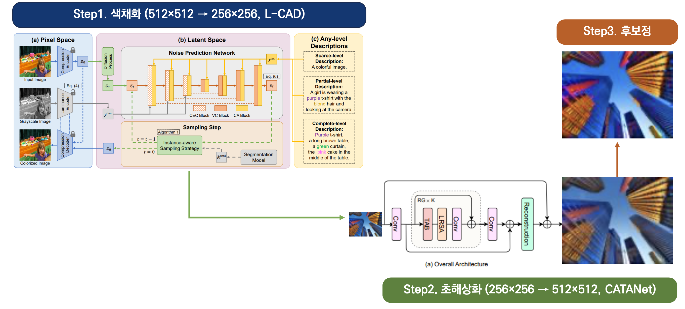
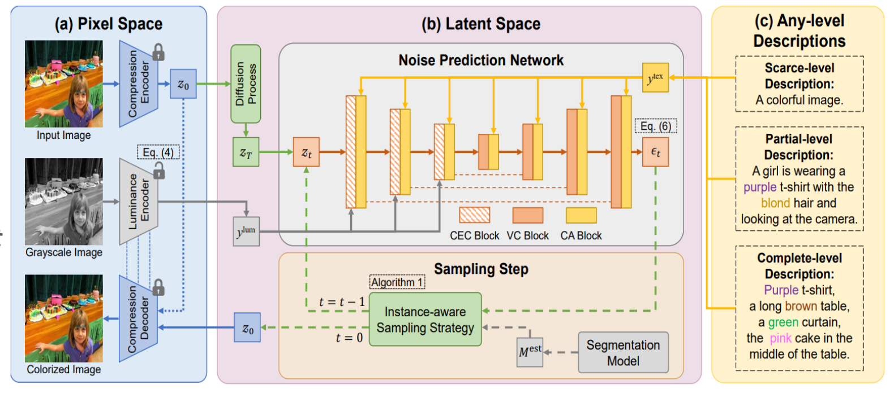

## 1. 프로젝트 개요

- **대회:** 2025 인하 인공지능 챌린지 (4인 팀)
- **주제:** 언어 정보(캡션) 기반 흑백 이미지 색채화
- **데이터:** 흑백 이미지(65k), 원본 컬러 이미지, 색채 관련 캡션 텍스트
- **평가:** `Score = 0.6 * HSV_Similarity + 0.4 * CLIP_Score` 
- **성과:** **최우수상 수상**

## 2. 핵심 파이프라인

본 팀은 **(1) 색채화 → (2) 초해상화 → (3) 후보정**의 3단계 파이프라인을 구축했습니다.

<figure style="margin: 2rem 0;">
  
  <figcaption style="text-align: center; color: #6b7280; font-size: 0.9rem; margin-top: 0.5rem; font-style: italic;">
    Figure 1. 전체 색채화 파이프라인 구조
  </figcaption>
</figure>

## 3. 주요 방법론

### Step 1. 색채화 (L-CAD)

<figure style="margin: 2rem 0;">
  
  <figcaption style="text-align: center; color: #6b7280; font-size: 0.9rem; margin-top: 0.5rem; font-style: italic;">
    Figure 2. L-CAD 모델 아키텍처
  </figcaption>
</figure>

- **모델:** Stable Diffusion을 색채화 태스크에 파인튜닝한 **L-CAD(Language-based Colorization with Any-level Descriptions)** 모델을 사용했습니다.
- **특징:**
    - **Luminance-encoder:** 흑백 이미지의 휘도(L 채널) 정보를 UNet에 직접 주입하여, 원본의 **구조와 윤곽을 보존**하면서 색상 정보만 입히도록 유도합니다.
    - **Any-level Description:** "A colorful image" (Scarce-level)부터 "A girl is wearing a purple t-shirt" (Partial-level)까지 다양한 수준의 텍스트 캡션을 조건(Condition)으로 사용하여 모델의 범용성을 확보했습니다.

### Step 2. 초해상화 (CATANet)

L-CAD로 생성된 저해상도(256x256) 이미지를 원본(512x512)으로 복원하기 위해 **CATANet(Cross-Attention Token Aggregation Network)** 초해상화 모델을 적용했습니다.

- **특징 (TAB):** `Token Aggregation Block`을 통해 객체 경계(IASA)와 영역 간 상호작용(IRCA)을 학습하여, 단순한 해상도 증가가 아닌, 세부 질감과 전역 색조의 균형을 맞추며 복원합니다.

### Step 3. 후보정 (Post-processing)

CLIP Score(텍스트 일치도)는 높지만 HSV Score(색상 유사도)가 낮은 문제를 해결하기 위해, 최종 이미지의 시각적 품질을 미세 조정했습니다.

- **적용 필터:** 감마 보정, CLAHE(대비 향상), 채도 강화, 언샤프 마스크(선명도), 양방향 필터(노이즈 감소) 등을 적용하여 최종 스코어를 극대화했습니다.

## 4. 결과

- 후보정 단계를 거치며 Public 스코어가 0.686에서 **0.703**으로 크게 향상되었습니다.
- L-CAD의 구조 보존 능력, CATANet의 고품질 복원, 세밀한 후보정 전략을 결합하여 **최우수상**을 수상했습니다.

<figure style="margin: 2rem 0;">
  
  <figcaption style="text-align: center; color: #6b7280; font-size: 0.9rem; margin-top: 0.5rem; font-style: italic;">
    Figure 3. 전체 파이프라인 결과
  </figcaption>
</figure>
