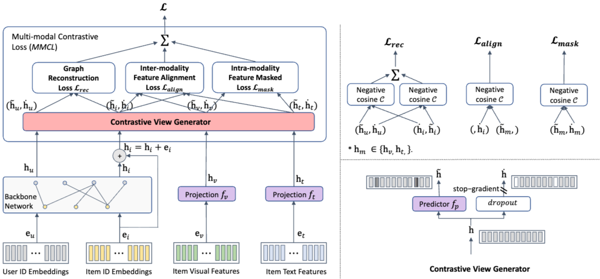

## 1. 프로젝트 개요

- **대회:** 2023년 인하 인공지능 챌린지
- **주제:** 멀티모달 데이터(메타데이터, 이미지, 텍스트) 기반 추천 시스템 개발
- **목표:** 사용자에게 선호할 만한 상위 50개 아이템을 추천 (평가 지표: NDCG@50)
- **성과:** **우수상 수상**

## 2. 핵심 문제: 데이터 희소성 (Data Sparsity)

- **데이터:** User 19만 명, Item 6.3만 개, Interaction 125만 건
- **문제:** User-Item Interaction Matrix의 **Sparsity(희소성)** 가 **99.9861%** 에 달하여, 일반적인 협업 필터링 방식으로는 유의미한 학습이 어려웠습니다.
- **해결:** 데이터 희소성 문제를 보완하기 위해 Item에 대한 **이미지 임베딩(4096차원)** 과 **텍스트 임베딩(384차원)** 데이터를 함께 활용하는 멀티모달 접근 방식을 채택했습니다.

## 3. 접근 방식: 그래프 기반 멀티모달 추천

User-Item 간의 상호작용과 고차 연결성(High-order Connectivity)을 효과적으로 모델링하기 위해 **그래프 기반 추천 시스템(GNN)** 을 채택했습니다.

### 3-1. 비교 모델

1. **MMGCN (Multi Modal GCN)**
각 Modality(Visual, Textual)별로 GCN을 독립적으로 적용하여 User/Item 벡터를 학습한 뒤, 최종 단계에서 이를 통합하는 모델입니다.

<figure style="margin: 2rem 0;">
  
  <figcaption style="text-align: center; color: #6b7280; font-size: 0.9rem; margin-top: 0.5rem; font-style: italic;">
    Figure 1. MMGCN (Multi-Modal Graph Convolutional Network) Architecture
  </figcaption>
</figure>

2. **GRCN (Graph Refined ConvNet)**
우연히 클릭된 "Potential false-positive edges"를 탐지하고 제거(Pruning)하는 Graph Refined Layer를 추가하여 노이즈에 강건한 모델입니다.

### 3-2. 최종 채택 모델: BM3 (Bootstrap Multi Modal Model)

최종적으로 2023년 4월에 발표된 **BM3** 모델을 채택했습니다.

<figure style="margin: 2rem 0;">
  
  <figcaption style="text-align: center; color: #6b7280; font-size: 0.9rem; margin-top: 0.5rem; font-style: italic;">
    Figure 2. The structure overview of the proposed BM3. Projections fv and ft, as well as predictor fp, are all one-layer MLPs. The parameters of predictor fp are shared in the Contrastive View Generator (bottom left) for ID embeddings and multi-modal latent representations.
  </figcaption>
</figure>

#### **주요 특징**

- **Backbone (LightGCN):** 기존 GCN에서 Feature Transformation과 Non-linear Activation을 제거한 **LightGCN**을 Backbone으로 사용하여, 계산 효율성을 높이고 추천 작업에 더 적합하게 만들었습니다.

- **학습 방식 (BYOL):** BPR Loss와 Negative Sampling을 사용하는 기존 방식 대신, **BYOL(Bootstrap Your Own Latent)** 방법론을 적용했습니다.
    - **Negative Sampling 불필요:** Contrastive Learning을 통해 Negative Sample 없이 학습이 가능하여 대규모 그래프에서 계산 비용을 획기적으로 줄였습니다.
    - **Multi Modal Contrastive Loss (MMCL):** 그래프 구조를 복원하는 Lrec, Item ID와 Modality 간의 관계를 정렬하는 Lalign, Modality 내 피처를 학습하는 Lmask를 결합한 손실 함수를 사용합니다.

## 4. 결과 및 성과

### **성능 비교 (NDCG@50)**

| 모델 | NDCG@50 |
|------|---------|
| **BM3** | **0.035** |
| GRCN | 0.028 |
| MMGCN | 0.018 |

### **주요 성과**

- **효율성:** BM3는 LightGCN과 BYOL을 채택하여 다른 복잡한 GNN 모델(MMGCN, GRCN 등) 대비 **메모리 사용량과 학습 속도(s/epoch) 면에서 높은 효율성**을 보였습니다.

- **수상:** 최종적으로 BM3 모델을 채택하여 2023 인하 인공지능 챌린지에서 **우수상**을 수상했습니다.

## 5. 기술 스택

- **Framework:** PyTorch, PyTorch Geometric
- **Models:** LightGCN, BYOL, BM3
- **Data:** User-Item Interaction, Image Embeddings (4096-dim), Text Embeddings (384-dim)
- **Evaluation Metric:** NDCG@50