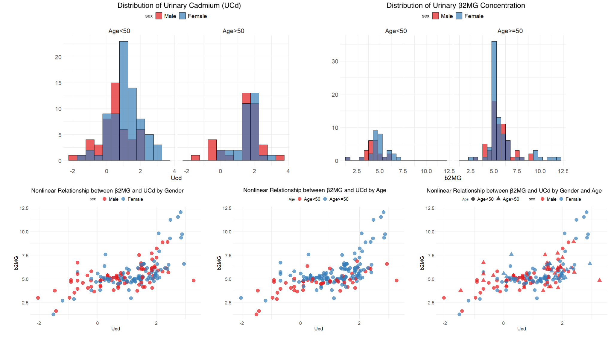
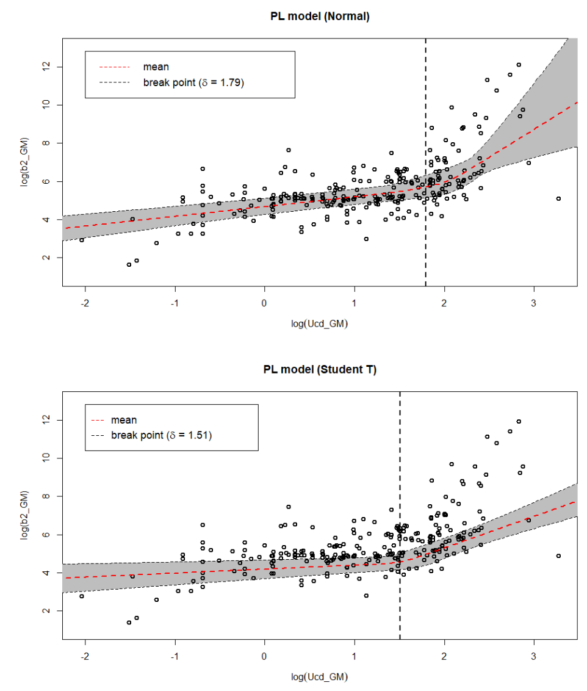
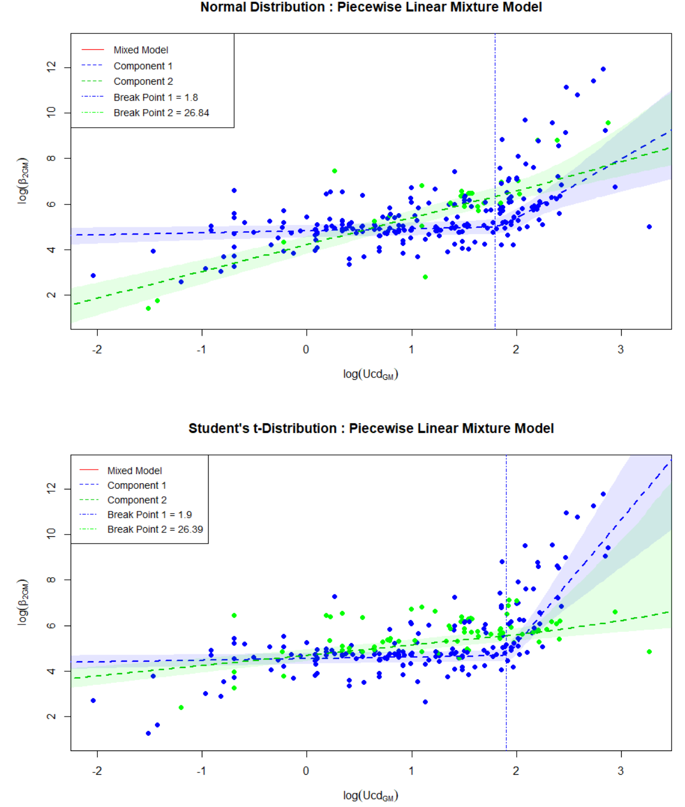

## Data Overview

**Exploratory Data Analysis**

We compiled data from 48 independent studies published between 1983 and 2022, encompassing 250 exposure groups. The dataset exhibits clear nonlinear associations between urinary cadmium (UCd) and β2-microglobulin (β2MG) concentrations, with notable differences across age and sex subgroups.

<figure style="margin: 2rem 0;">
  
  <figcaption style="text-align: center; color: #6b7280; font-size: 0.9rem; margin-top: 0.5rem; font-style: italic;">
    Figure 2. UCd and β2MG distributions by sex and age
  </figcaption>
</figure>

---
## Method
**Standard Piecewise Linear Model Performance**

Conventional piecewise linear (PL) models were fitted under both Normal and Student's t-distribution assumptions. While both models captured the general trend, they exhibited limitations in handling heterogeneity and outliers, particularly evident in the post-breakpoint slope estimation.

<figure style="margin: 2rem 0;">
  
  <figcaption style="text-align: center; color: #6b7280; font-size: 0.9rem; margin-top: 0.5rem; font-style: italic;">
    Figure 1. Standard-PL model under Normal and Student's t assumptions
  </figcaption>
</figure>

---
**Proposed Model: HME-PL with Robust Distribution**

To address the limitations of standard models, we developed a Hierarchical Mixture of Experts (HME) framework that identifies latent subgroup structures within the data. The model assigns observations to either a "mainstream" component (Component 1, blue) or an "atypical" component (Component 2, green) using a gating network based on age.

The Student's t-distribution assumption further enhances robustness by downweighting extreme observations, resulting in more stable parameter estimates and improved model fit.

<figure style="margin: 2rem 0;">
  
  <figcaption style="text-align: center; color: #6b7280; font-size: 0.9rem; margin-top: 0.5rem; font-style: italic;">
    Figure 3. HME-PL model with two latent components
  </figcaption>
</figure>

---

## Model Performance Comparison

**HME-PL vs Standard-PL**

| Model Type | Distribution | DIC | NRMSE |
|------------|-------------|-----|-------|
| **Standard-PL** | Normal | 1093.0 | 1.000 |
| **Standard-PL** | Student's t | 815.9 | 0.899 |
| **HME-PL** | Normal | 809.0 | 1.000 |
| **HME-PL** | Student's t | **520.4** | **0.854** |

The HME-PL model with Student's t-distribution achieved a **52% reduction in DIC** compared to the standard Normal model, demonstrating superior model fit and robustness.

---

## Benchmark Dose Estimates

**Age- and Sex-Specific BMD and BMDL**

Based on the optimal HME-PL model with Student's t-distribution, we derived benchmark doses (BMD) and their lower confidence bounds (BMDL) for different demographic subgroups using a clinical cut-off of 1000 µg/g creatinine.

| Subgroup | BMD₅ (BMDL₅) | BMD₁₀ (BMDL₁₀) |
|----------|--------------|----------------|
| **Male, age < 50** | 7.30 (6.89) | 7.91 (7.53) |
| **Male, age ≥ 50** | 7.08 (6.69) | 7.61 (7.16) |
| **Female, age < 50** | 7.27 (6.69) | 7.87 (7.54) |
| **Female, age ≥ 50** | **7.05 (6.68)** | **7.57 (7.23)** |

Older females consistently exhibited the **lowest BMD and BMDL values**, indicating greater sensitivity to cadmium-induced nephrotoxicity. These findings support the need for age- and sex-specific regulatory guidelines.

---

**Key Contributions**

- **Hierarchical Mixture of Experts (HME)** framework to capture latent heterogeneity across studies
- **Student's t-distribution** for robustness against outliers and heavy-tailed noise
- **Age- and sex-specific BMD estimates** for tailored risk assessment
- **52% reduction in DIC** compared to standard models, demonstrating superior performance