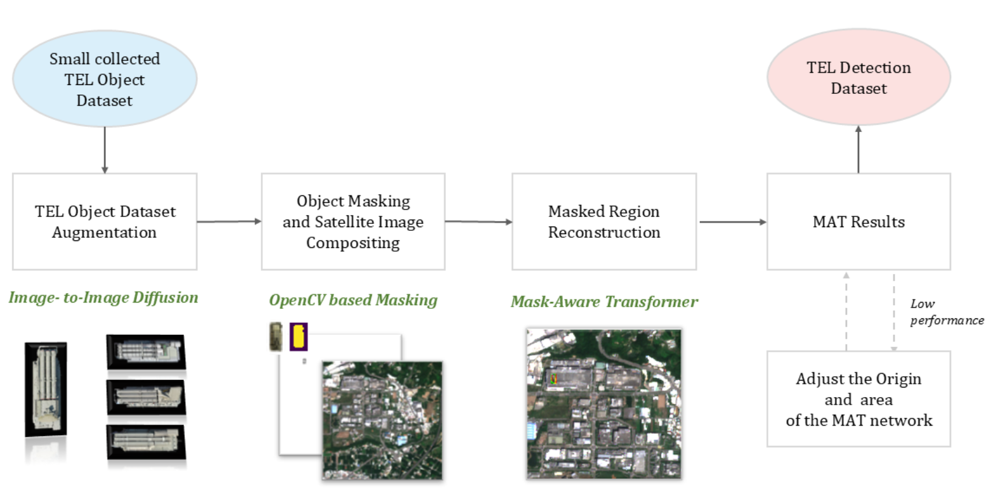
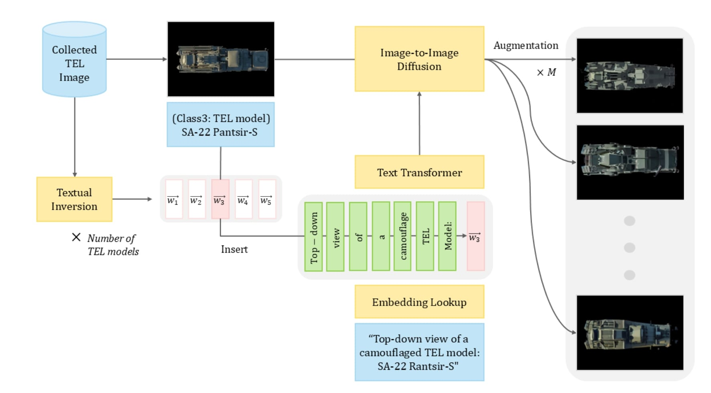
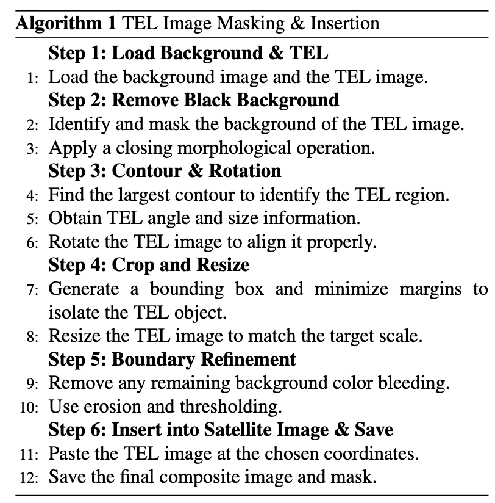
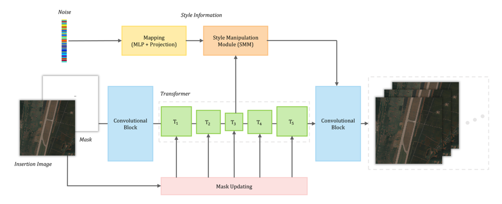
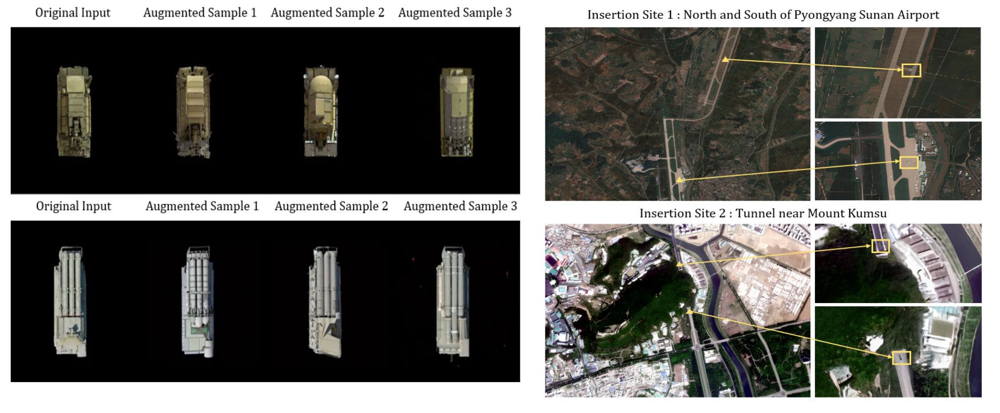

---
### Method Overview

This study proposes a three-stage synthetic data generation framework for TEL detection in satellite imagery.

<figure style="margin: 2rem 0;">
  
  <figcaption style="text-align: center; color: #6b7280; font-size: 0.9rem; margin-top: 0.5rem; font-style: italic;">
    Figure 1. Overview of the proposed generation pipeline for TEL detection dataset
  </figcaption>
</figure>

---
**Stage 1: TEL Dataset Augmentation**

The first stage employs a conditional diffusion model to augment existing TEL instances while preserving structural fidelity and introducing variation in camouflage patterns.

<figure style="margin: 2rem 0;">
  
  <figcaption style="text-align: center; color: #6b7280; font-size: 0.9rem; margin-top: 0.5rem; font-style: italic;">
    Figure 2. TEL dataset augmentation process using diffusion-based semantic preservation
  </figcaption>
</figure>

---
**Stage 2: Context-Aware Object Insertion**

Augmented TEL objects are strategically inserted into realistic satellite backgrounds identified through open-source intelligence, including tunnel entrances, mountainous regions, and airfield aprons.

<figure style="margin: 2rem 0;">
  
  
  <figcaption style="text-align: center; color: #6b7280; font-size: 0.9rem; margin-top: 0.5rem; font-style: italic;">
    Figure 3. Context-aware TEL object insertion into satellite imagery backgrounds
  </figcaption>
</figure>

---
**Stage 3: Transformer-Based Inpainting**

The final stage applies a transformer-based inpainting model to eliminate boundary artifacts and ensure spatial and spectral continuity around inserted objects.

<figure style="margin: 2rem 0;">
  
  <figcaption style="text-align: center; color: #6b7280; font-size: 0.9rem; margin-top: 0.5rem; font-style: italic;">
    Figure 4. Inpainting process of missing areas using transformer-based model
  </figcaption>
</figure>

---
**Results**

The proposed framework achieves a 38% reduction in Fréchet Inception Distance compared to conventional GAN-based approaches, demonstrating superior quality in synthetic dataset generation.

<figure style="margin: 2rem 0;">
  
  <figcaption style="text-align: center; color: #6b7280; font-size: 0.9rem; margin-top: 0.5rem; font-style: italic;">
    Figure 5. Augmentation Results
  </figcaption>
</figure>

---
**Key Contributions**

- **Three-stage synthetic data generation framework** integrating diffusion models, context-aware insertion, and transformer-based inpainting
- **Semantic-preserving augmentation** that maintains structural fidelity while introducing realistic variations
- **Context-aware background selection** using open-source intelligence for realistic placement
- **Significant performance improvement** over existing GAN-based methods